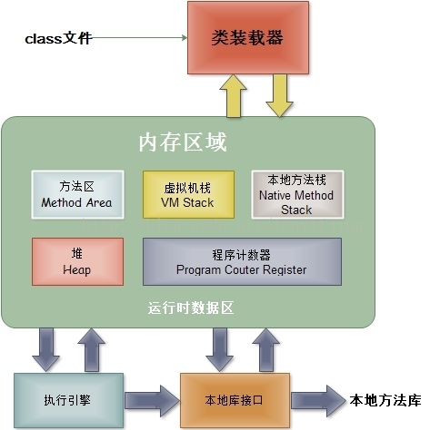
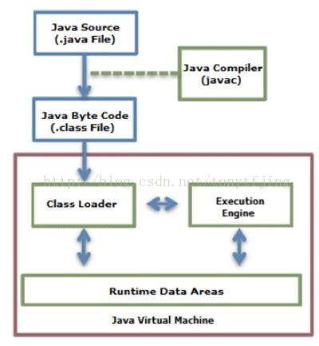
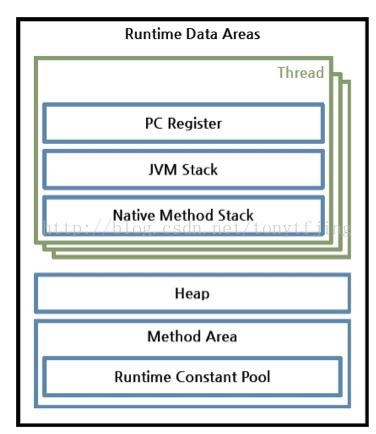
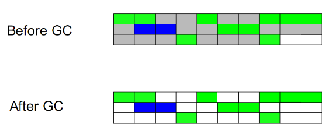
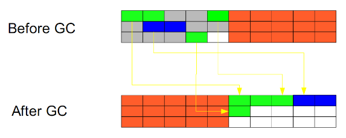
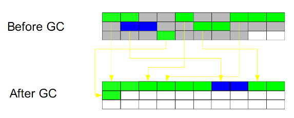
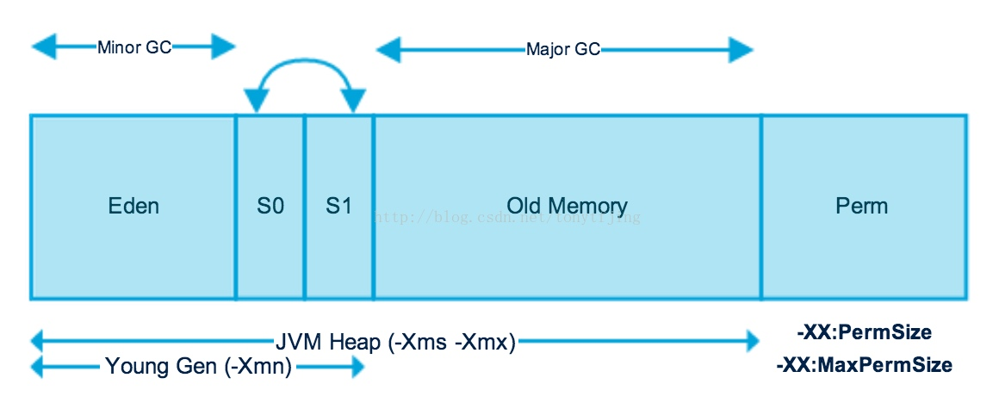

# 引述：
简单描述下jvm的垃圾回收策略，比如引用计数、标记清除等策略。
#JVM基本构成

JVM 主要包含以下部分
1.  类加载器（ClassLoader）：在 JVM 启动时或者在类运行时将需要的 class 加载到 JVM 中，下图为从 Java 源文件到 JVM 的整个过程。

2.执行引擎： 负责执行 class 文件中包含的字节码指令
3.内存区: 是在 JVM 运行的操作所分配的内存区。

* 方法区（Method Area）： 用于存储类结构信息的地方，包括常量池、静态变量、构造函数等。还包含了一个运行时常量池。
* Java 堆（Heap）： 存储 Java 实例或者对象的地方，这块是 GC 的主要区域，从存储的内容来分析，我们可以知道方法区和堆是被所有 Java 线程共享的。
* Java 栈（Stack）： Java 栈总是和线程关联在一起，每当创建一个线程时，JVM 就会为祖国线程创建一个对应的 Java 栈。在这个 Java 栈中又会包含多个栈帧，每运行一个方法就会创建一个栈帧，这个栈帧的功能可以用于存储局部变量、返回值、操作栈等。每一个方法从调用直至执行完成的过程，就对应一个栈针在 Java 栈中入栈到出栈的过程，所以 Java 栈是线程私有的。
* 程序计数器（PC register）： 用于保存当前线程执行的内存地址，由于 JVM 程序是多线程执行的（线程轮流切换），所以为了保证线程切换回来后，还能恢复到原先状态，需要引入一个独立的计数器，记录中断的地方，可见程序计数器也是线程私有的。
* 本地方法栈（Native Method Stack）：和 Java 栈的作用类似，只不过是为 JVM 使用到的 Native 方法服务的，也是当前线程私有的。

4.本地方法接口：主要是调用 C 或 C++ 实现的本地方法及返回结果。

# 内存分配
在了解回收机制的时候，我们还得知道GC回收的是什么的东西，显然是内存，那么内存在 JVM 又是怎么进行分配的？
Java 内存分配的原理是先一次性分配一块较大的空间，然后每次 new 是都在该空间上进行分配和释放，有点像内存池的做法。
Java 一般内存申请有两种：静态内存和动态内存。比如 int 类型变量的申请内存，所申请的内存是固定的，所以是一种静态存储。Java 栈、程序计数器、本地方法栈 都是线程私有的，而线程的管理与栈针密切相关,栈中的栈针会随着方法的结束也会撤销，内存自然也就回收了。重点是在方法区和 Java 堆，这部分的只有才程序运行机器我们才知道会创建哪些对象，所以这部分内存的分配和回收是动态进行的，一般来说我们所说的垃圾回收也是针对这两块。

#回收策略
我们所谈及的回收策略一般来说包含两个步骤，一个是检测垃圾，另外一个是回收垃圾。
## 检测垃圾
* 引用计数法

 给一个对象添加引用计数器，每当有个地方引用到，计数器加1，引用失效减1。无法处理循环引用的问题，比如两个均需要的回收的对象A，B。如果A中引用了B，B中又引用了A，则AB均不会被回收
 
* 可达性分析算法

以根集对象为起点进行搜索，如果有对象不可达的话，既是垃圾对象，这里的根集一般包括 Java 栈中引用的对象、方法区常量池中引用的对象，大部分是动态分配的内存。
## 回收垃圾
* 标记-清除

    标记所有需要返回的对象，然后统一回收。
    
    
* 复制
    
    在存储空间划分两个相等的区域，每次只使用其中一个区域。垃圾回收时，遍历当前的使用区域，把正在使用中的对象复制到另外一个区域中，此算法每次只处理正在使用中的对象，复制成本较小，同时复制成功后还能进行内存碎片的整理。

* 标记-整理

此算法结合了“标记-清除”和“复制”两个算法的优点。也是分两阶段，第一阶段从根节点开始标记所有被引用对象，第二阶段遍历整个堆，把清除未标记对象并且把存活对象“压缩”到堆的其中一块，按顺序排放。此算法避免了“标记-清除”的碎片问题，同时也避免了“复制”算法的空间问题

* 分代收集算法
    
    这个是现在主流虚拟机常用的垃圾收集算法，是基于一个现象：不同的对象的生命周期是不一样的。因此，不同生命周期的对象可以采用不同的收集方式，以便提高回收效率。一般根据存活的时间将对象划分成：年轻代、年老代、持久代。其中持久代主要存放的是类信息，所以与 Java 对象的回收关系不大，重点是在年轻代和年老代。
    

   * 年轻代：轻代被分为3个部分——Enden区和两个Survivor区（From和to）当Eden区被对象填满时，就会执行Minor GC。并把所有存活下来的对象转移到其中一个survivor区（假设为from区）。Minor GC同样会检查存活下来的对象，并把它们转移到另一个survivor区（假设为to区）。这样在一段时间内，总会有一个空的survivor区。经过多次GC周期后，仍然存活下来的对象会被转移到年老代内存空间。通常这是在年轻代有资格提升到年老代前通过设定年龄阈值来完成的。需要注意，Survivor的两个区是对称的，没先后关系，from和to是相对的。
   * 年老代：在年轻代中经历了N次回收后仍然没有被清除的对象，就会被放到年老代中，可以说他们都是久经沙场而不亡的一代，都是生命周期较长的对象。对于年老代和永久代，就不能再采用像年轻代中那样搬移腾挪的回收算法
    * 持久代：用于存放静态文件，比如Java类、方法等。持久代对垃圾回收没有显著印象

