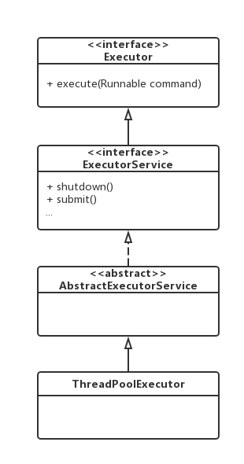
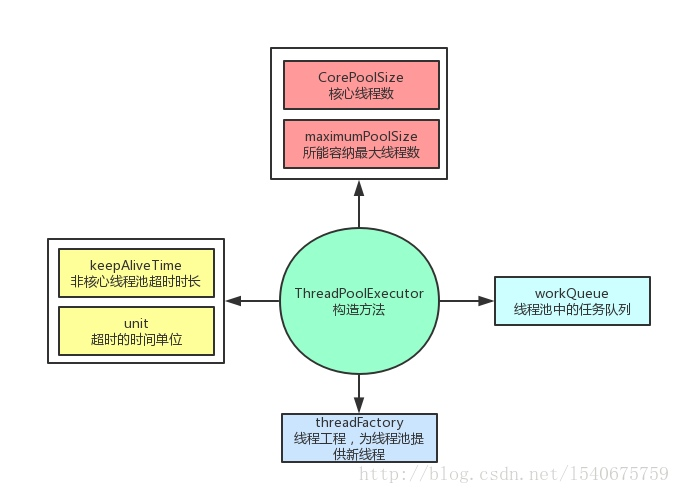
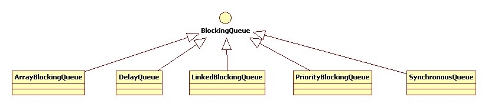
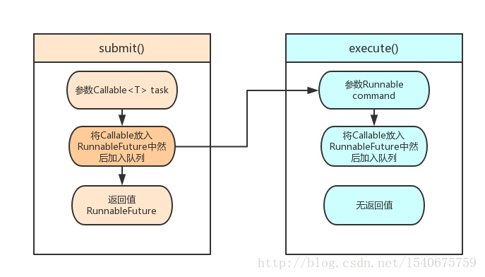

# 简介
线程是操作系统进行调度操作的最小单元，线程池是一种线程复用的手段，通过缓存已经创建的线程，来减小线程使用过程中的消耗cpu的情况，同时把任务和任务的执行进行了解耦，把任务的和任务的执行进行解耦，使之任务本身和任务的执行进行分离。

如图显示



最顶层是继承了 Java 中的 Executor 接口，该接口中只处理一个Runnable对象，而真正实现实现线程池的类是 ThreadPoolExecutor,通过提供一系列的参数来配置线程池，也可以通过参数创建不同类型的线程池。

# 使用
##线程池构造方法
ThreadPoolExecutory有4个构造方法，分别是：


```
ThreadPoolExecutor(int corePoolSize,
                        int maximumPoolSize,
                        long keepAliveTime,
                        TimeUnit unit,
                        BlockingQueue<Runnable> workQueue) 

```


```
ThreadPoolExecutor(int corePoolSize,
                        int maximumPoolSize,
                        long keepAliveTime,
                        TimeUnit unit,
                        BlockingQueue<Runnable> workQueue,
                        ThreadFactory threadFactory)

```


```
ThreadPoolExecutor(int corePoolSize,
                        int maximumPoolSize,
                        long keepAliveTime,
                        TimeUnit unit,
                        BlockingQueue<Runnable> workQueue,
                        RejectedExecutionHandler handler)

```


```
ThreadPoolExecutor(int corePoolSize,
                        int maximumPoolSize,
                        long keepAliveTime,
                        TimeUnit unit,
                        BlockingQueue<Runnable> workQueue,
                        ThreadFactory threadFactory,
                        RejectedExecutionHandler handler)

```

各个参数的含义如下：



着重来研究下线程池队列 workQueue，常见有以下几种

* ArrayBlockingQueue是一个基于数组结构的有界阻塞队列。
* LinkedBlockingQueue是基于链表结构的阻塞队列，吞吐量通常高于ArrayBlockingQueue。
* SynchronousQueue是一个不存储元素的阻塞队列，么诶过插入操作必须等到另一个线程调用移除操作，否则插入操作一直处于阻塞状态。
* PriorityBlockQueue是线程安全的，内部使用显示锁作保障。但是存储的对象必须是实现Comparable接口的 因为PriorityBlockingQueue队列会根据内部存储的每一个元素的compareTo方法比较每个元素的大小




## 向线程池中提交任务




我们可以通过execute提交任务，但是execute方法没有返回值，无法判断任务是否被线程池执行成功。这时我们可以采用submit方法，本质上submit方法最后还是调用execute方法，通过future的get方法获取返回值，get方法会阻塞线程直到任务完成，而使用get(long time ,TimeUtil unit)方法则会阻塞一段时间后立即返回，这时有可能任务没有执行完成。


```
   public <T> Future<T> submit(Callable<T> task) {
        if (task == null) throw new NullPointerException();
        RunnableFuture<T> ftask = newTaskFor(task);
        //还是通过调用execute
        execute(ftask);
        //最后会将包装好的Runable返回
        return ftask;
    }
```

#### 使用示例

```
threadsPool.execute(new Runnable() {

@Override

public void run() {

// TODO Auto-generated method stub


}


});

```
execute(Runnable command) 的源码如下：


```
  public void execute(Runnable command) {
        if (command == null)
            throw new NullPointerException();
     
        int c = ctl.get();
        if (workerCountOf(c) < corePoolSize) {
            if (addWorker(command, true))
                return;
            c = ctl.get();
        }
        if (isRunning(c) && workQueue.offer(command)) {
            int recheck = ctl.get();
            if (! isRunning(recheck) && remove(command))
                reject(command);
            else if (workerCountOf(recheck) == 0)
                addWorker(null, false);
        }
        else if (!addWorker(command, false))
            reject(command);
    }
```

大致分为3个步骤（源码里面有英文解释，推荐还是去看源码英文备注）:
1.判断当前线程数是否大于核心线程。如果小于并且可以加入队列，则获取核心线程
2.判断核心线程是否在运行并且任务队列未满，并且再次获取核心线程，判断核心线程是否可以运行且当前的线程已经被移除了，则拒绝执行当前的command；如果核心线程为0，则新建一个线程。
3.添加任务队列失败，则走reject流程。

# 常见线程池

## FixThreadPool模式

```
 public static ExecutorService newFixThreadPool(int nThreads){  
     return new ThreadPoolExecutor(nThreads, nThreads, 0L, TimeUnit.MILLISECONDS, new LinkedBlockingQueue<Runnable>());  
}  
//使用  
 Executors.newFixThreadPool(5).execute(r);  
```
从配置参数来看，FixThreadPool只有核心线程，并且数量固定的，也不会被回收，所有线程都活动时，因为队列没有限制大小，新任务会等待执行。由于线程不会回收，FixThreadPool会更快地响应外界请求。
## SingleThreadPool模式


```
 public static ExecutorService newSingleThreadPool (int nThreads){  
     return new FinalizableDelegatedExecutorService ( new ThreadPoolExecutor (1, 1, 0, TimeUnit. MILLISECONDS, new LinkedBlockingQueue<Runnable>()) );  
 }  
 //使用  
 Executors.newSingleThreadPool ().execute(r);  
```

SingleThreadPool只有一个核心线程，确保所有任务都在同一线程中按顺序完成。因此不需要处理线程同步的问题。
## CacheThreadPool模式


```
 public static ExecutorService newCachedThreadPool(int nThreads){  
     return new ThreadPoolExecutor(0, Integer.MAX_VALUE, 60L, TimeUnit. SECONDS, new SynchronousQueue<Runnable>());  
 }  
 //使用  
 Executors.newCachedThreadPool().execute(r); 
```
CachedThreadPool只有非核心线程，最大线程数非常大，所有线程都活动时，会为新任务创建新线程，否则利用空闲线程（60s空闲时间，过了就会被回收，所以线程池中有0个线程的可能）处理任务。任务队列SynchronousQueue相当于一个空集合，导致任何任务都会被立即执行。
## ScheduleThreadPool模式


```
 public static ScheduledExecutorService newScheduledThreadPool(int corePoolSize){  
     return new ScheduledThreadPoolExecutor(corePoolSize);  
 }
public ScheduledThreadPoolExecutor(int corePoolSize){  
     super(corePoolSize, Integer.MAX_VALUE, 0, NANOSECONDS, new DelayedQueue ());  
}  
//使用，延迟1秒执行，每隔2秒执行一次Runnable r  
 Executors. newScheduledThreadPool (5).scheduleAtFixedRate(r, 1000, 2000, TimeUnit.MILLISECONDS); 
```

核心线程数固定，非核心线程（闲着没活干会被立即回收）数没有限制。从上面代码也可以看出，ScheduledThreadPool主要用于执行定时任务以及有固定周期的重复任务。


