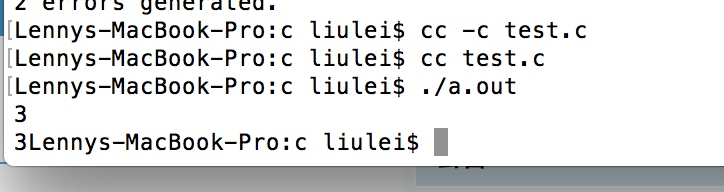

1.使用编译器将源文件中的代码转换为二进制代码，这个过程叫做编译。

将终端的工作路径切换到源文件所在的路径。

cc -c 源文件的名称。例如：cc -c main.c

如果没有意外的话，就会在当前工作路径下生成一个.o文件，这个文件叫做目标文件。

目标文件存储的是.c文件中代码对应的二进制指令。

 

2.目标文件中仅仅存储的是.c文件中的代码对应的二进制指令。

一个程序如果想要交给CPU执行，光这样是不行的。

还必须为这个目标文件添加一些启动代码。添加启动代码的过程叫做链接。

cc 目标文件名称。例如：cc main.o

如果一切正常的情况下，就会生成一个a.out文件。这个文件就是最终可以执行的程序了。

 

3.执行这个a.out程序，就可以看到程序的执行结果了。

./a.out

谁也不能随随便便成功，它来自彻底的自我管理与毅力。

