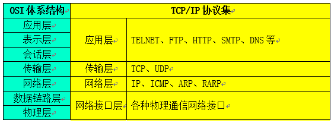
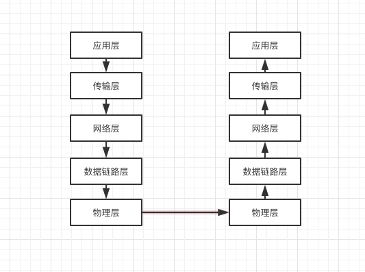
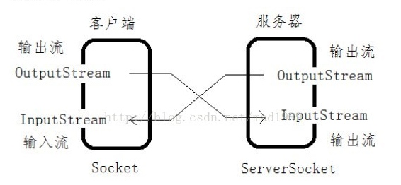
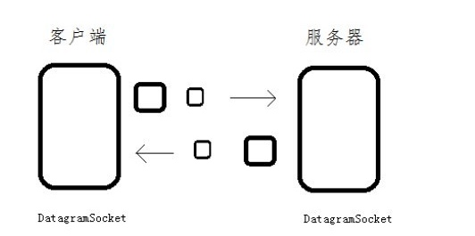
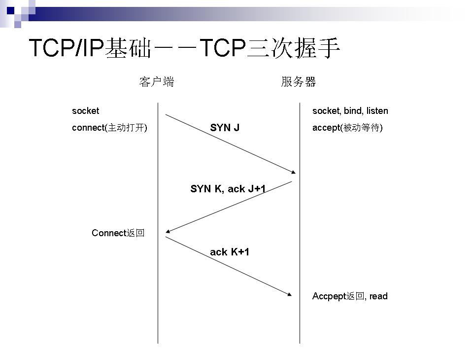
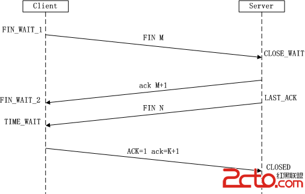

# OSI体系结构

也可以通俗讲网络层的，这个模型把网络通信的工作详细的分为6层，也可以更详细的分为7层，

下面是以 5 层为基础来介绍各个层之间的联系与职责

* 物理层 一般指的是物理层次的接口，比如电缆、网口等。
* 数据链路层：将最原始的数据（如 bit）组装成帧。
* 网络层  提供独立硬件的逻辑寻址，该层姜数据链路提供的帧组成数据包，实现物理地址与逻辑地址的转换，其中包括 IP 协议(网际协议)、ICMP 协议(Intent 互联网控制报文协议)、IGMP 协议(Intent 组管理协议)
* 传输层 为网络提供数据流来源、错误控制和确认服务，比如 TCP 协议、UDP 协议
* 应用层 为网络提供排错、文件传输，远程控制和 Internet 操作，比如HTTP、HTTPS、FTP

#TCP 协议与 UDP 协议

##TCP 协议

通俗来讲，TCP 协议是一个进程到另外一个进程的面向连接的协议集合，是精确的连接模式，可以提供可靠的的通信传输，由下图可以更直观的感觉出来

UDP 是一种不可靠的连接方式，通常被用于广播和细节控制的通信传输

两则的区别的本质在于：

在我们创建Socket进行通讯的时候，其中的某个函数参数我们通常填为SOCK_STREAM。即socket(PF_INET, SOCK_STREAM, 0)，这表示建立一个socket用于流式网络通讯。 
　  SOCK_STREAM 这种的特点是面向连接的，即每次收发数据之前必须通过 connect 建立连接，也是双向的，即任何一方都可以收发数据，协议本身提供了一些保障机制保证它是可靠的、有序的，即每个包按照发送的顺序到达接收方。 
　　而 SOCK_DGRAM 这种是User Datagram Protocol协议的网络通讯，它是无连接的，不可靠的，因为通讯双方发送数据后不知道对方是否已经收到数据，是否正常收到数据。任何一方建立一个 socket 以后就可以用 sendt o发送数据，也可以用 recvfrom 接收数据。根本不关心对方是否存在，是否发送了数据。它的特点是通讯速度比较快。大家都知道TCP是要经过三次握手的，而 UDP 没有。 
　　上述是为什么tcp/udp有区别的原因，关键是在创建 Socket 的时候选择的参数不同。接下去讲下区别。
* TCP 面向连接，UDP 是无连接的。
* TCP 提供可靠服务，既无差错，不丢失，准时送达；UDP 不一定能准时送达。
* TCP 面向字节流；UDP 面向报文，并且无阻塞控制
* TCP 是一对一通信，而 UDP 支持一对一，一对多，多对多。
* TCP 的逻辑通信信道是全开的双工的可靠信道， UDP 则是不可靠信道

# 三次握手

第一次握手：建立连接时，客户端发送 syn 包(syn=j)到服务器，并进入 SYN_SEND 状态，等待服务器确认
第二次握手：服务器收到 syn 包，必须确认客户的 SYN（ack=j+1），同时自己也发送一个 SYN 包（syn=k），即 SYN+ACK 包，此时服务器进入 SYN_RECV 状态；
 第三次握手：客户端收到服务器的 SYN＋ACK 包，向服务器发送确认包 ACK(ack=k+1)，此包发送完毕，客户端和服务器进入 ESTABLISHED 状态，完成三次握手。 完成三次握手，客户端与服务器开始传送数据.

# 四次挥手

第一次:客户端进程发出连接结束的报文，报文首部的信息为 FIN=M，此时客户端进入 FIN_WAIT_1 状态
第二次:服务端收到连接结束的报文，发出确认连接结束报文，ACK=M+1，并让自身进入 CLOSE_WAIT状态，处于一种半封闭的状态，客户端收到服务端的确认连接结束请求后，自身进入 FIN_WAIT_2 状态，等待服务器发出结束连接的报文。
第三次: 服务端进入 CLOSE_WAIT 状态后，不在乎客服端当前的状态，接着继续发送同意结束连接的报文，此时服务端进入 LAST_ACk 状态，等待客户端收到同意结束连接的报文
第四次: 客户端收到同意结束连接的报文后，必须发出确认结束的报文，客户端进入 TIME_WAIT状态，到这里 TCP 连接还有最后一步要处理，必须经过 2*MSL(各个厂商的时间并不统一)的时间后，客户端才终于完成本次操作，服务端接收到消息后，立即进入 CLOSE 状态，到这里整个释放流程才结束。并且 2*MSL()的时间并不能确保连接完成结束，等待2个MSL的时间是一种极限忍耐的表现。

