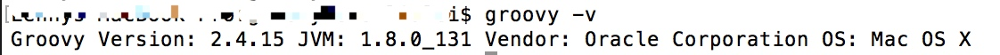

# 介绍

Groovy是一种动态语言，相当于Java的扩展。当我们执行Groovy脚本时，Groovy会现将其编译成Java类字节码，然后通过JVM来执行这个Java类。gradle是基于Groovy语言进行开发的。

#配置
## 下载zip包，并解压
http://groovy-lang.org/download.html

##在配置文件中增加Groovy的环境变量
在终端输入

```
vim ~/.bash_profile
``` 

加入以下配置

```
# groovy
export PATH=$PATH:/Users/xuhongchuan/install/groovy-2.4.4/bin
```
##保存并校验

```
source ~/.bash_profile
groovy -v
```


    
#常识
Groovy 语言的语法和 Python 有些类似


