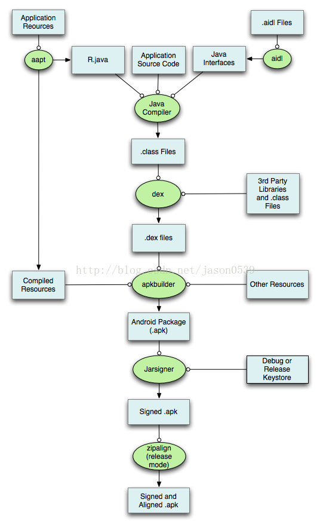

* build的整个过程
* grade assembleRelease 有哪些task

# 流程
我们以Build为切入口，也就是我们点击了Android studio的绿色三角形的图片。出口是在我们的设备上面装了一个一个apk，这篇文章研究中间的过程

1.打包资源文件，生成R.java文件
2.处理aidl文件，生成相对应的.java文件
3.编译工程代码，生成相应的class文件
4.转换所有的class文件，生成classes.dex文件
5.打包生成apk
6.对apk文件进行签名
7.对签名后的 apk文件进行对其处理，不处理不被允许发送到google mark

 

第一步：打包资源文件，生成R.java文件。
【输入】Resource文件（就是工程中res中的文件）、Assets文件（相当于另外一种资源，这种资源Android系统并不像对res中的文件那样优化它）、AndroidManifest.xml文件（包名就是从这里读取的，因为生成R.java文件需要包名）、Android基础类库（Android.jar文件）
【工具】aapt工具
【输出】打包好的资源（bin目录中的resources.ap_文件）、R.java文件（gen目录中）
       打包资源的工具aapt，大部分文本格式的XML资源文件会被编译成二进制格式的XML资源文件，除了assets和res/raw资源被原装不动地打包进APK之外，其它的资源都会被编译或者处理。 。
生成过程主要是调用了aapt源码目录下的Resource.cpp文件中的buildResource（）函数，该函数首先检查AndroidManifest.xml的合法性，然后对res目录下的资源子目录进行处理，处理的函数为makeFileResource（），处理的内容包括资源文件名的合法性检查，向资源表table添加条目等，处理完后调用compileResourceFile（）函数编译res与asserts目录下的资源并生成resources.arsc文件，compileResourceFile（）函数位于aapt源码目录的ResourceTable.cpp文件中，该函数最后会调用parseAndAddEntry（）函数生成R.java文件，完成资源编译后，接下来调用compileXmlfile()函数对res目录的子目录下的xml文件分别进行编译，这样处理过的xml文件就简单的被“加密”了，最后将所有的资源与编译生成的resorces.arsc文件以及“加密”过的AndroidManifest.xml文件打包压缩成 resources.ap_ 文件（使用Ant工具命令行编译则会生成与build.xml中“project name”指定的属性同名的ap_文件）。

第二步：处理aidl文件，生成相应的java文件。
【输入】源码文件、aidl文件、framework.aidl文件
【工具】aidl工具
【输出】对应的.java文件
对于没有使用到aidl的android工程，这一步可以跳过。aidl工具解析接口定义文件并生成相应的java代码供程序调用。

第三步：编译工程源代码，生成下相应的class文件。
【输入】源码文件（包括R.java和AIDL生成的.java文件）、库文件（.jar文件）
【工具】javac工具
【输出】.class文件
    这一步调用了javac编译工程src目录下所有的java源文件，生成的class文件位于工程的bin\classes目录下，上图假定编译工程源代码时程序是基于android SDK开发的，实际开发过程中，也有可能会使用android NDK来编译native代码，因此，如果可能的话，这一步还需要使用android NDK编译C/C++代码，当然，编译C/C++代码的步骤也可以提前到第一步或第二步。

第四步：转换所有的class文件，生成classes.dex文件。
【输入】 .class文件（包括Aidl生成.class文件，R生成的.class文件，源文件生成的.class文件），库文件（.jar文件）
【工具】javac工具
【输出】.dex文件
    前面多次提到，android系统dalvik虚拟机的可执行文件为dex格式，程序运行所需的classes.dex文件就是在这一步生成的，使用的工具为dx，dx工具主要的工作是将java字节码转换为dalvik字节码、压缩常量池、消除冗余信息等。

第五步：打包生成apk。
【输入】打包后的资源文件、打包后类文件（.dex文件）、libs文件（包括.so文件，当然很多工程都没有这样的文件，如果你不使用C/C++开发的话）
【工具】apkbuilder工具
【输出】未签名的.apk文件
    打包工具为apkbuilder，apkbuilder为一个脚本文件，实际调用的是android-sdk\tools\lib\sdklib.jar文件中的com.android.sdklib.build.ApkBuilderMain类。它的代码实现位于android系统源码的sdk\sdkmanager\libs\sdklib\src\com\android\sdklib\build\ApkBuilderMain.java文件，代码构建了一个ApkBuilder类，然后以包含resources.arsc的文件为基础生成apk文件，这个文件一般为ap_结尾，接着调用addSourceFolder()函数添加工程资源，addSourceFolder()会调用processFileForResource（）函数往apk文件中添加资源，处理的内容包括res目录与asserts目录中的文件，添加完资源后调用addResourceFromJar（）函数往apk文件中写入依赖库，接着调用addNativeLibraries()函数添加工程libs目录下的Native库（通过android NDK编译生成的so或bin文件），最后调用sealApk（）关闭apk文件。

第六步：对apk文件进行签名。
【输入】未签名的.apk文件
【工具】jarsigner
【输出】签名的.apk文件
android的应用程序需要签名才能在android设备上安装，签名apk文件有两种情况：一种是在调试程序时进行签名，使用eclipse开发android程序时，在编译调试程序时会自己使用一个debug.keystore对apk进行签名；另一种是打包发布时对程序进行签名，这种情况下需要提供一个符合android开发文档中要求的签名文件。签名的方法也分两种：一种是使用jdk中提供的jarsigner工具签名；另一种是使用android源码中提供的signapk工具，它的代码位于android系统源码build\tools\signapk目录下。

第七步：对签名后的apk文件进行对齐处理。
【输入】签名后的.apk文件
【工具】zipalign工具
【输出】对齐后的.apk文件
    这一步需要使用的工具为zipalign，它位于android-sdk\tools目录，源码位于android系统源码的build\tools\zipalign目录，它的主要工作是将apk包进行对齐处理，使apk包中的所有资源文件距离文件起始偏移为4字节整数倍，这样通过内存映射访问apk文件时速度会更快，验证apk文件是否对齐过的工作由ZipAlign.cpp文件的verify()函数完成，处理对齐的工作则由process（）函数完成。

