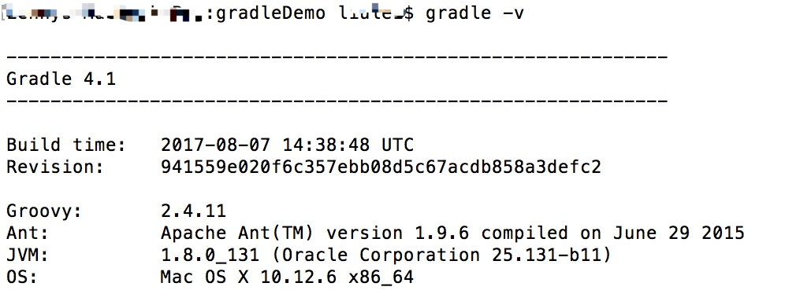

# Groovy介绍
Groovy是一种动态语言，相当于Java的扩展。当我们执行Groovy脚本时，Groovy会现将其编译成Java类字节码，然后通过JVM来执行这个Java类。

# 配置环境变量
创建变量名：GRADLE_HOME ，变量值：
C:\Users\jjx.gradle\wrapper\dists\gradle-4.1-all\d3xh0kipe7wr2bvnx5sk0hao8\gradle-4.1
加入path
;%GRADLE_HOME%\bin;
检查,如下就ok。





gradle 的Task集合
调用命令行 即可看到

```
gradle tasks 
```


```
Help tasks
----------
buildEnvironment - Displays all buildscript dependencies declared in root project 'gradleDemo'.
components - Displays the components produced by root project 'gradleDemo'. [incubating]
dependencies - Displays all dependencies declared in root project 'gradleDemo'.
dependencyInsight - Displays the insight into a specific dependency in root project 'gradleDemo'.
dependentComponents - Displays the dependent components of components in root project 'gradleDemo'. [incubating]
help - Displays a help message.
model - Displays the configuration model of root project 'gradleDemo'. [incubating]
projects - Displays the sub-projects of root project 'gradleDemo'.
properties - Displays the properties of root project 'gradleDemo'.
tasks - Displays the tasks runnable from root project 'gradleDemo'.

```

