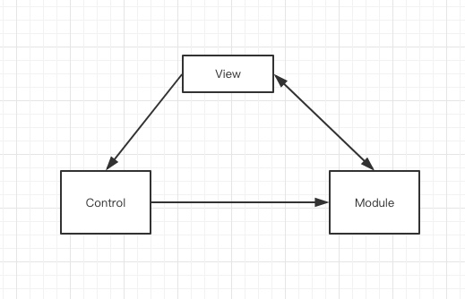
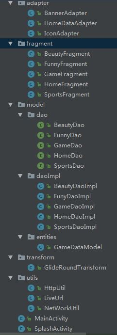
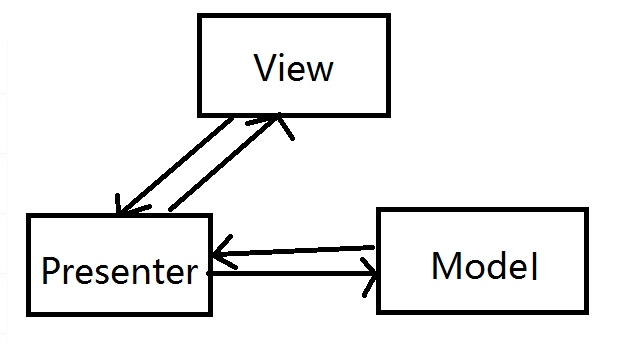

# 研究MVC、MVP、MVVM三种常见的设计模式

## 简介 
所谓的设计模式其实是一种框架结构的体呈现,目的分离应用程序的页面展示，网络数据交互，数据呈现，随着项目复杂度的不断变化，新的框架也在不断的更新迭代，从最早的MVC模式，到后面的MVP以及MVVM，均是对项目的一种重构。

## MVC设计框架
这个比较简单，适合一些中小型的项目。
### 关键字
#### M
 Module，模型层，用户数据管理，通常是一些 javaBean, db,sharePreference,network,图片处理等耗时操作均应该放在该层。
#### V 
View，视图层，展现给用户的视图，是应用程序最外层的壳，比如 xml 布局，drawable 显示
####C 
controller 控制层，也叫中间层。一般指的是在四大组，接收 View 层的指令，处理相关指令，并对处理后的指令进去进一步操作，下发指令到Module层。

### 结构

### 详细逻辑
以点击某个按钮为例，当用户在 View 布局上发生事件交互的时候，View 层会下发指令到 control 层，control监听到事件交互，并进行处理，接着 control 下发指令到 Module 层，Module 层进行数据更新后，把数据直接显示在View上面。

### 优缺点
#### 优点
* 可维护性高，结构清晰明了，利于后期维护
* 重用性高，比如多个 View 视图可以共同依赖同一个Module 层
* 利于项目工程化管理 由于每个层各司其职，每一个层具有鲜明的特征
#### 缺点   
* View 层与Module 层相互耦合，不利于后期的维护
* View 对 Module 访问低效率

## MVP设计框架
MVP 是在作为 MVC 的一种演化，解决了 MVC 的一些问题，主要是解决 MVC 的 View 与 Module的耦合。MVP 的 Module 层是和 MVC 层是一样，其他的层次发生了变化，看具体的解析
### 关键字
#### M
 Module，模型层，用户数据管理，通常是一些 javaBean, db,sharePreference,network,图片处理等耗时操作均应该放在该层。
#### V 
View，视图层,一般指的是四大组件，四大组件对作为View，来完成应用程序界面的展示
#### P
Presenter 控制层，也叫中间层。相当于一个中间桥梁的作用，用于解决View 层与 Module 层的耦合，一般一个 Presenter 可以对应多个 View，一个Presenter 也可以对应多个Module

### 联系

### 详细逻辑
从图中我们可以了解到 View 与 Module 已经完全没有联系了，所有的操作均是在 Presenter 中操作的，Presenter 成了中间桥梁。于操作view层发出的事件传递到presenter层中，presenter 层去操作model 层，并且将数据返回给 view 层，整个过程中 view 层和 model 层完全没有联系。一般在设计View 与 Presenter 的时候会采用接口的形式，来降低 Presenter 与 View 的耦合。

### 优缺点
#### 优点
* 降低View 与 Module 的耦合
* 使View 层更加的饱满
* 一个Presenter 可以对应多个 View 
* 便与测试，可以脱离用户接口来测试某些逻辑。

#### 缺点   
* Presenter 层会存在引用View 层的东西出现空指针的问题

## MVVM设计框架
MVVM 最早还是有由微软提出来的，MVVM 和 MVP 的设计理念类似，两则 Module 和 View 都是一样
### 关键字
#### M
 Module，模型层，用户数据管理，通常是一些 javaBean, db,sharePreference,network,图片处理等耗时操作均应该放在该层。
#### V 
View，视图层,一般指的是四大组件，四大组件对作为View，来完成应用程序界面的展示
####M 
ViewModule 控制层 ViewModule
### 联系

### 详细逻辑图
流程其实是和 MVP 基本类似，最大的区别是在 View 和 ViewModule 中，View 层和ViewModule 是相互绑定的。

### 优缺点
#### 优点
* 低耦合，View 层和 Module 层可以独立工作
* 在 View 层中不需要findViewById 操作，可以使用 DataBinding 完成
* View 和 ViewModule 的双向绑定是支持生命周期检测的，不会存在 ViewModule 空指针的错误

#### 缺点   

