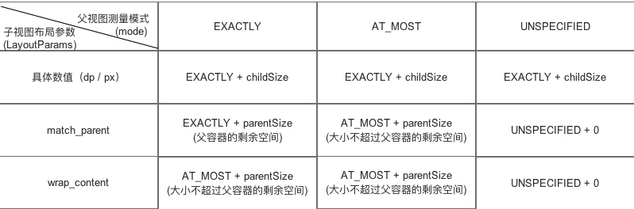

# 定义
用来测量自定义View的宽高的。MeasureSpec通常翻译为“测量规格”，在很大程度上决定了一个 View 的尺寸规格，这个过程还受父容器的影响，因为父容器影响 view 的 MeasureSpec 的创建过程，在测试过程中，系统会将 View 的 LayoutParam 根据父容器所施加的规则转换为对应的 MeasureSpec
# MeasureSpec
它是一个32位的int数据，其中高2位代表SpecModule即某种测量模式，低30位SpecSize代表在该模式下的规格大小。

mode 分为三大类
* MeasureSpec.EXACTLY:父类容器已经精准的检测到子View所需的宽高，View的大小即为SpecSize
* MeasureSpec.AT_MOST:父容器未能检测出子View所需要的精确大小，但是指定了一个可用大小即SpecSize，View的测量带下不能超过SpecSize
* MeasureSpec.UNSPECIFIED:父类View 对子View的宽度或者高度不做限制，即子View是他所期望的任意值，用作于系统内部，暂不讨论。

 
# Measure 与 LayoutParams 的对应关系
系统内部是通过 MeasureSpec 来测量，当我们给 View 设置 LayoutParams 在 view 测量的时候，系统会将 LayoutParams 在父容器的约束下转换成对应的 MeasureSpec，然后会再根据这个 MeasureSpec 来确定测量后的宽/高。对于 DecorView ，其 MeasureSpec 由窗口的尺寸和其自身的 LayoutParam 来共同决定，对于普通 View，其 MeasureSpec 由容器父类的 MeasureSpec 和自身的 LayoutParam 来共同决定。

 
对于 DecorView 而言，在 ViewRootImpl 的 measureHirearchy 方法中确认了 DecorView 的 MeasureSpec 

```
childWidthMeasureSpec = getRootMeasureSpec(desiredWindowWidth, lp.width);
childHeightMeasureSpec = getRootMeasureSpec(desiredWindowHeight, lp.height);
           
```
再看下 getRootMeasureSpec 函数

```
   private static int getRootMeasureSpec(int windowSize, int rootDimension) {
        int measureSpec;
        switch (rootDimension) {

        case ViewGroup.LayoutParams.MATCH_PARENT:
            // Window can't resize. Force root view to be windowSize.
            measureSpec = MeasureSpec.makeMeasureSpec(windowSize, MeasureSpec.EXACTLY);
            break;
        case ViewGroup.LayoutParams.WRAP_CONTENT:
            // Window can resize. Set max size for root view.
            measureSpec = MeasureSpec.makeMeasureSpec(windowSize, MeasureSpec.AT_MOST);
            break;
        default:
            // Window wants to be an exact size. Force root view to be that size.
            measureSpec = MeasureSpec.makeMeasureSpec(rootDimension, MeasureSpec.EXACTLY);
            break;
        }
        return measureSpec;
    }
```
由上图我们可以知道以下结论
* LayoutParams.MATCH_PARENT：精确模式，大小就是窗口的大小
* LayoutParams.WRAP_CONTENT：最大模式，大小不一样，不能超过父类大小
* 固定大小

对于普通 View 的 MeasureSpec 的确认,由 ViewGroup 的 measureChildWithMargins 来传递
```
   protected void measureChildWithMargins(View child,
            int parentWidthMeasureSpec, int widthUsed,
            int parentHeightMeasureSpec, int heightUsed) {
        final MarginLayoutParams lp = (MarginLayoutParams) child.getLayoutParams();

        final int childWidthMeasureSpec = getChildMeasureSpec(parentWidthMeasureSpec,
                mPaddingLeft + mPaddingRight + lp.leftMargin + lp.rightMargin
                        + widthUsed, lp.width);
        final int childHeightMeasureSpec = getChildMeasureSpec(parentHeightMeasureSpec,
                mPaddingTop + mPaddingBottom + lp.topMargin + lp.bottomMargin
                        + heightUsed, lp.height);

        child.measure(childWidthMeasureSpec, childHeightMeasureSpec);
    }

```
接着看 getChildMeasureSpec 方法。

```
  public static int getChildMeasureSpec(int spec, int padding, int childDimension) {
        int specMode = MeasureSpec.getMode(spec);
        int specSize = MeasureSpec.getSize(spec);

        int size = Math.max(0, specSize - padding);

        int resultSize = 0;
        int resultMode = 0;

        switch (specMode) {
        // Parent has imposed an exact size on us
        case MeasureSpec.EXACTLY:
            if (childDimension >= 0) {
                resultSize = childDimension;
                resultMode = MeasureSpec.EXACTLY;
            } else if (childDimension == LayoutParams.MATCH_PARENT) {
                // Child wants to be our size. So be it.
                resultSize = size;
                resultMode = MeasureSpec.EXACTLY;
            } else if (childDimension == LayoutParams.WRAP_CONTENT) {
                // Child wants to determine its own size. It can't be
                // bigger than us.
                resultSize = size;
                resultMode = MeasureSpec.AT_MOST;
            }
            break;

        // Parent has imposed a maximum size on us
        case MeasureSpec.AT_MOST:
            if (childDimension >= 0) {
                // Child wants a specific size... so be it
                resultSize = childDimension;
                resultMode = MeasureSpec.EXACTLY;
            } else if (childDimension == LayoutParams.MATCH_PARENT) {
                // Child wants to be our size, but our size is not fixed.
                // Constrain child to not be bigger than us.
                resultSize = size;
                resultMode = MeasureSpec.AT_MOST;
            } else if (childDimension == LayoutParams.WRAP_CONTENT) {
                // Child wants to determine its own size. It can't be
                // bigger than us.
                resultSize = size;
                resultMode = MeasureSpec.AT_MOST;
            }
            break;

        // Parent asked to see how big we want to be
        case MeasureSpec.UNSPECIFIED:
            if (childDimension >= 0) {
                // Child wants a specific size... let him have it
                resultSize = childDimension;
                resultMode = MeasureSpec.EXACTLY;
            } else if (childDimension == LayoutParams.MATCH_PARENT) {
                // Child wants to be our size... find out how big it should
                // be
                resultSize = View.sUseZeroUnspecifiedMeasureSpec ? 0 : size;
                resultMode = MeasureSpec.UNSPECIFIED;
            } else if (childDimension == LayoutParams.WRAP_CONTENT) {
                // Child wants to determine its own size.... find out how
                // big it should be
                resultSize = View.sUseZeroUnspecifiedMeasureSpec ? 0 : size;
                resultMode = MeasureSpec.UNSPECIFIED;
            }
            break;
        }
        //noinspection ResourceType
        return MeasureSpec.makeMeasureSpec(resultSize, resultMode);
    }

```
方法比较简单，主要是根据父容器的 MeasureSpec 同时结合本身的 LayoutParams 来确定子元素的 MeasureSpec。
如果子 View 在XML布局文件中对于大小的设置采用wrap_content，那么不管父 View 的specMode 是  MeasureSpec.AT_MOST还是 MeasureSpec.EXACTLY ，对于子 View 而言系统给它设置的 specMode 都是 MeasureSpec.AT_MOST，并且其大小都是parentLeftSize 即父 View 目前剩余的可用空间。这时wrap_content就失去了原本的意义，变成了match_parent一样了，如果需要改变这个特征，可以在自定义 view 的时候重写 onMeasure，给 weight 和 height 一个默认值，我们常见的 TextView 和 Button 都有个默认值。
 


# 测量过程
## 单一 View 的绘制过程
 

View 的入口是 measure，此方法是一个 final 的方法，意味着不能被重写，所以我们直接看 onMeasure 方法

```
    protected void onMeasure(int widthMeasureSpec, int heightMeasureSpec) {
        setMeasuredDimension(getDefaultSize(getSuggestedMinimumWidth(), widthMeasureSpec),
                getDefaultSize(getSuggestedMinimumHeight(), heightMeasureSpec));
    }
```

setMeasuredDimension 方法计算了 view 具体的宽/高值。所以还得看看 getDefaultSize 方法

```
    public static int getDefaultSize(int size, int measureSpec) {
        int result = size;
        int specMode = MeasureSpec.getMode(measureSpec);
        int specSize = MeasureSpec.getSize(measureSpec);

        switch (specMode) {
        case MeasureSpec.UNSPECIFIED:
            result = size;
            break;
        case MeasureSpec.AT_MOST:
        case MeasureSpec.EXACTLY:
            result = specSize;
            break;
        }
        return result;
    }
```
我们只需要看 MeasureSpec.AT_MOST 和 MeasureSpec.EXACTLY 的情况，此函数返回的 specSize 奏是 view 的测量结果。View 的宽高由 specSize 来决定。
## ViewGroup 的绘制
viewGroup的 onMeasure 方法是一个抽象类，但是它有一个 measureChild 方法
所以自定义View在重写onMeasure()的过程中应该手动处理View的宽或高为wrap_content的情况。
 
