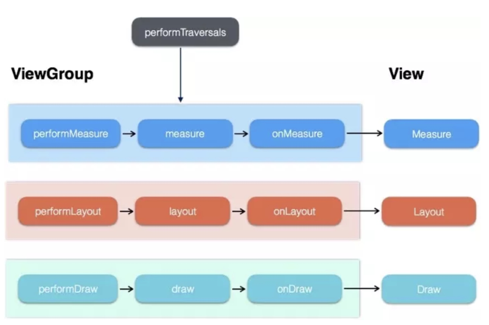
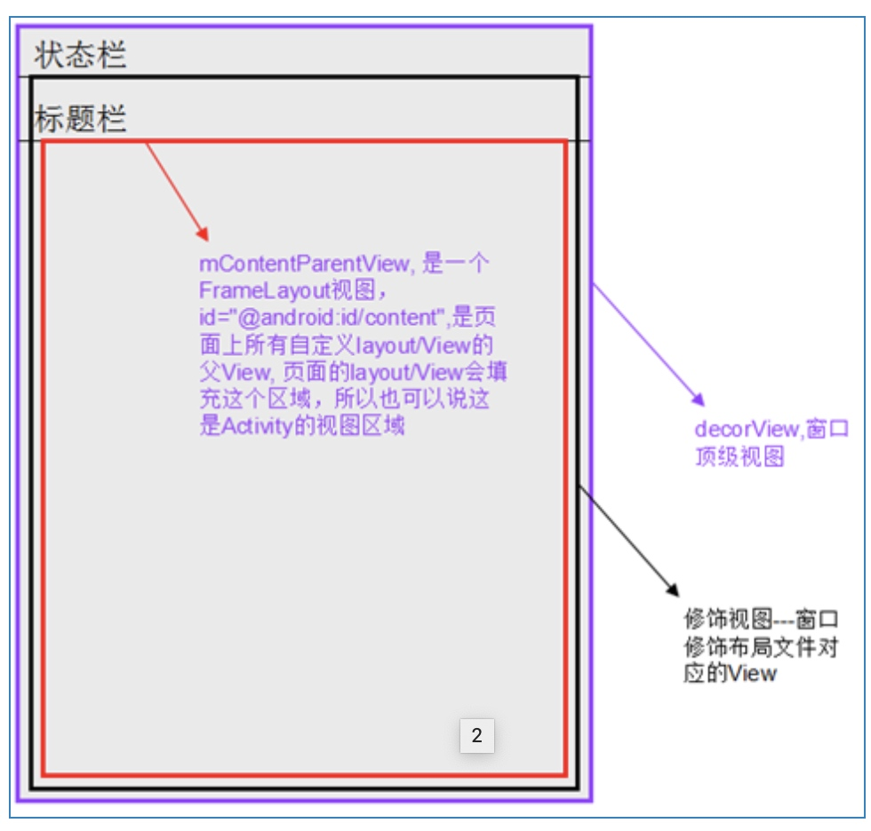

# ViewRoot
 对应于 ViewRootImpl 类，是 View 的根，它控制了 View 的测量和绘制，是连接 WindowManager 和D ectorView 的纽带，View的三大流程均是通过ViewRoot来完成的  在 ActivityThread中，当 Activity 对象被创建完成后，会将 DectorView 添加到 Window 中，同时会创建 ViewRootImpl 对象，并将该对象和 DectorView 建立关联。
WindowManagerGlobal.java 的 addView 中
```
   root = new ViewRootImpl(view.getContext(), display);

            view.setLayoutParams(wparams);

            mViews.add(view);
            mRoots.add(root);
            mParams.add(wparams);

            // do this last because it fires off messages to start doing things
            try {
                root.setView(view, wparams, panelParentView);
            } catch (RuntimeException e) {
                // BadTokenException or InvalidDisplayException, clean up.
                if (index >= 0) {
                    removeViewLocked(index, true);
                }
                throw e;
            }
```
因为他们同时持有WindowSession通过Binder与WMS通信，同时持有 IWindow 作为 WSM 的回调接口，用于 touch 事件的回调。其中绘制的起点是 ViewRootImpl 的performTraversals ，其中在 measure 会调用 onMesure 方法，在 onMeasure 方法中则会对所有的子元素进行 measure 的过程，当 measure 方法从父容器到子容器中，这样就完成了一次 measure 的过程，接着子容器会重复父容器的 measure 过程，如此反复就完成了整个 view 数的便利。




#  DecorView
<<<<<<< HEAD
DectorView对象是所有应用窗口(Activity界面)的根View，继承了 FrameLayout,最顶部的 View 图层一般情况下它包含了LinearLayout，LinearLayout 里面有上下两部分，上部是标题栏(具体手机具体分析)，下部是内容区域，其中我们在设置setContentView的时候所设置的布局文件本质是把布局写在下部的内容区域里面，该内容区域的id是 content(android.R.id.content), DecorView 其实是一个 FrameLayout,View 层的时间都先经过 DecorView，然后才会传递到 View。

```
protected ViewGroup generateLayout(DecorView decor) {
　　//1,获取<Application android:theme=""/>, <Activity/>节点指定的themes或者代码requestWindowFeature()中指定的Features, 并设置
　　TypedArray a = getWindowStyle();
　　//...
　　
　　//2,获取窗口Features, 设置相应的修饰布局文件，这些xml文件位于frameworks/base/core/res/res/layout下
　　int layoutResource;
　　int features = getLocalFeatures();
　　if ((features & ((1 << FEATURE_LEFT_ICON) | (1 << FEATURE_RIGHT_ICON))) != 0) {
　　　　if (mIsFloating) {
　　　　　　TypedValue res = new TypedValue();
　　　　　　getContext().getTheme().resolveAttribute(com.android.internal.R.attr.dialogTitleIconsDecorLayout, res, true);
　　　　　　layoutResource = res.resourceId;
　　　　} else {
    　　layoutResource = com.android.internal.R.layout.screen_title_icons;
　　}
　　removeFeature(FEATURE_ACTION_BAR);
　　} else if ((features & ((1 << FEATURE_PROGRESS) | (1 << FEATURE_INDETERMINATE_PROGRESS))) != 0 && (features & (1 << FEATURE_ACTION_BAR)) == 0) {
　　layoutResource = com.android.internal.R.layout.screen_progress;
　　//...
　　
　　mDecor.startChanging();
　　//3, 将上面选定的布局文件inflate为View树，添加到decorView中
　　View in = mLayoutInflater.inflate(layoutResource, null);
　　decor.addView(in, new ViewGroup.LayoutParams(MATCH_PARENT, MATCH_PARENT));
　　//将窗口修饰布局文件中id="@android:id/content"的View赋值给mContentParent, 后续自定义的view/layout都将是其子View
　　ViewGroup contentParent = (ViewGroup)findViewById(ID_ANDROID_CONTENT);
　　if (contentParent == null) {
　　　　throw new RuntimeException("Window couldn't find content container view");
　　}
　　//...
}

```
=======
继承了 FrameLayout,最顶部的 View 图层一般情况下它包含了LinearLayout，LinearLayout 里面有上下两部分，上部是标题栏(具体手机具体分析)，下部是内容区域，其中我们在设置setContentView的时候所设置的布局文件本质是把布局写在下部的内容区域里面，该内容区域的id是 content(android.R.id.content), DecroView 其实是一个 FrameLayout,View 层的时间都先经过 DecorView，然后才会传递到 View。
>>>>>>> 6bb229a4507ca45141bd3270cb93f6aee9ba6a17

