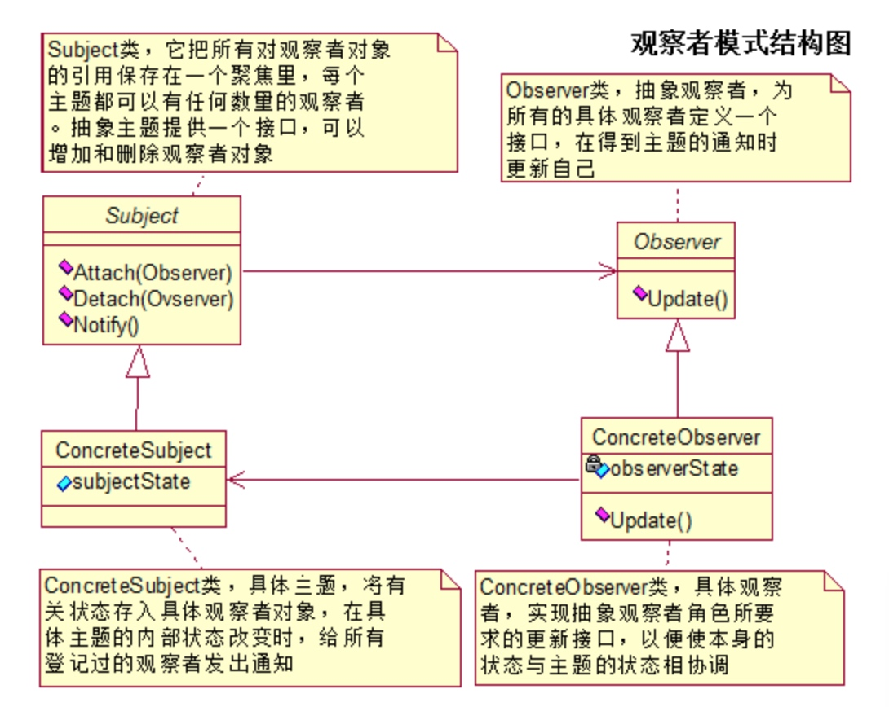
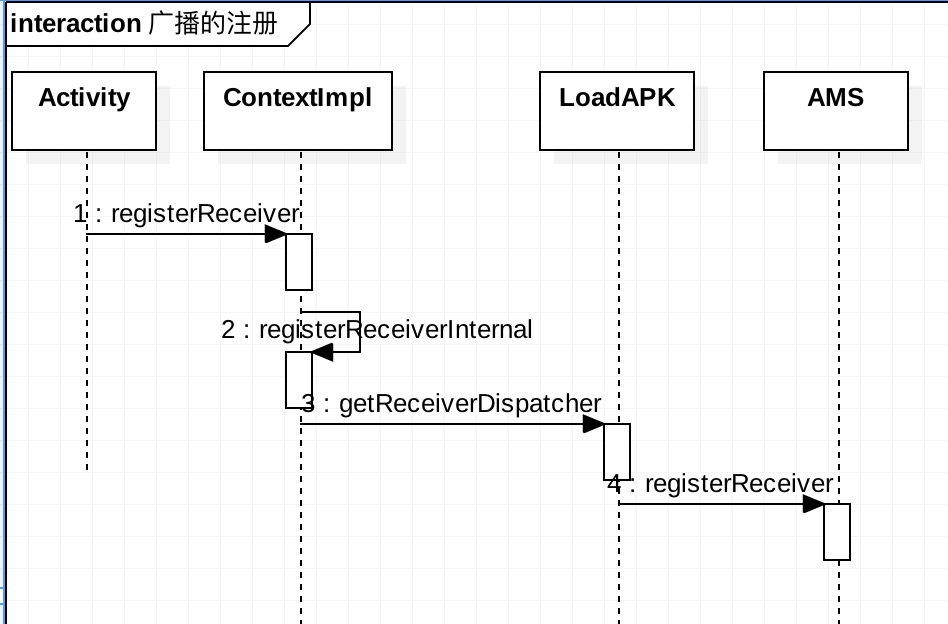
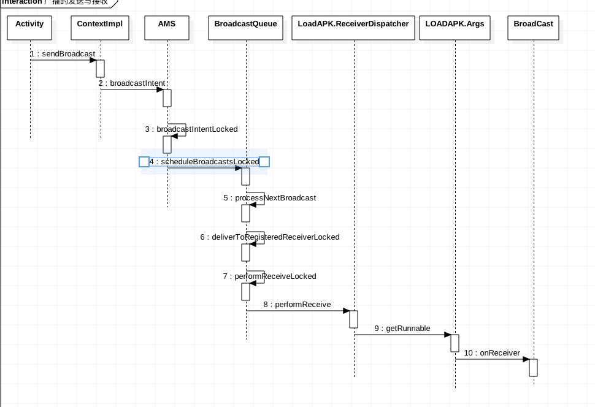

# 本质
是一个观察模式 


###角色

* 抽象观察者: Observer ,观察者的抽象类，定义了一个接口，使得收到被观察着的变更通知后可以及时更新数据
* 具体观察者: 具体观察者，收到被观察着的变更通知后更新自身的状态。
* 抽象被观察者：Observerable，也就是被观察者，抽象主题角色把所有观察者对象的引用保存在一个集合里面，抽象主题提供了一个接口，可以增加和删除观察对象。
* 具体被观察者：CurrentObserverable,具体主题，该角色将有关状态存入具体观察者对象，

# Broadcast 的注册，发送，接收
## 广播注册



### 入口：

```
Intent registerReceiver(@Nullable BroadcastReceiver receiver,IntentFilter filter);

```
前面都比较简单，我们直接看 ContextImpl 的 registerReceiverInternal 的方法

```
 private Intent registerReceiverInternal(BroadcastReceiver receiver, int userId,
            IntentFilter filter, String broadcastPermission,
            Handler scheduler, Context context, int flags) {
        IIntentReceiver rd = null;
        if (receiver != null) {
            if (mPackageInfo != null && context != null) {
                if (scheduler == null) {
                    scheduler = mMainThread.getHandler();
                }
                rd = mPackageInfo.getReceiverDispatcher(
                    receiver, context, scheduler,
                    mMainThread.getInstrumentation(), true);
            } else {
                if (scheduler == null) {
                    scheduler = mMainThread.getHandler();
                }
                rd = new LoadedApk.ReceiverDispatcher(
                        receiver, context, scheduler, null, true).getIIntentReceiver();
            }
        }
        try {
            final Intent intent = ActivityManager.getService().registerReceiver(
                    mMainThread.getApplicationThread(), mBasePackageName, rd, filter,
                    broadcastPermission, userId, flags);
            if (intent != null) {
                intent.setExtrasClassLoader(getClassLoader());
                intent.prepareToEnterProcess();
            }
            return intent;
        } catch (RemoteException e) {
            throw e.rethrowFromSystemServer();
        }
    }
```
分2步，
第一步
这个 rd 变量代表的是 IIntentReceiver，这个是一个 Binder 对象 ，通过 rd 与 AMS 交互，并且通过 handler 传递消息。
变量 mPackageInfo 代表的是 LoadAPK ，用于广播的接收，而这个 scheduler 其实就是 ActivityThread 里面的 H，这个就不在赘述了，大家都懂。有了这个 handler 后就可以给应用分发消息了，着重分析下 mPackageInfo.getReceiverDispatcher 函数。

```
 public IIntentReceiver getReceiverDispatcher(BroadcastReceiver r,
            Context context, Handler handler,
            Instrumentation instrumentation, boolean registered) {
        synchronized (mReceivers) {
            LoadedApk.ReceiverDispatcher rd = null;
            ArrayMap<BroadcastReceiver, LoadedApk.ReceiverDispatcher> map = null;
            if (registered) {
                map = mReceivers.get(context);
                if (map != null) {
                    rd = map.get(r);
                }
            }
            if (rd == null) {
                rd = new ReceiverDispatcher(r, context, handler,
                        instrumentation, registered);
                if (registered) {
                    if (map == null) {
                        map = new ArrayMap<BroadcastReceiver, LoadedApk.ReceiverDispatcher>();
                        mReceivers.put(context, map);
                    }
                    map.put(r, rd);
                }
            } else {
                rd.validate(context, handler);
            }
            rd.mForgotten = false;
            return rd.getIIntentReceiver();
        }
    }
```

根据传入的参数，拿到缓存中的 rd,如果没有则新建一个 ReceiverDispatcher，最开始的时候肯定是为null,所以会进行创建过程，会把 r 作为 key 存放在一个 map 中，这个 map 同时也被以 context 为 key ，名字叫 mReceivers 的 Map 持有,这样就可以保证给定 Context 与 Broadcast 就可以查看到是否有对应的 ReceiverDispatcher，如果有的话就直接返回  ，再看看 ReceiverDispatcher类，这个是 LoadAPK 的一个内部类 ，在他的构造方法里面创建了 mIIntentReceiver 一个对象，这个对象继承了 IIntentReceiver.Stub ，这个哈函数返回的是 IIntentReceiver 就是 ReceiverDispatcher 中的 mIIntentReceiver 变量。
最后一步当然是调用 AMS 里面的 registerReceiver 方法，当 AMS 接收到广播后会，会通过传过去的 rd,通知对应的广播。


```
 public Intent registerReceiver(IApplicationThread caller, String callerPackage,
            IIntentReceiver receiver, IntentFilter filter, String permission, int userId,
            int flags) {
        enforceNotIsolatedCaller("registerReceiver");
        ArrayList<Intent> stickyIntents = null;
        ProcessRecord callerApp = null;
        final boolean visibleToInstantApps
                = (flags & Context.RECEIVER_VISIBLE_TO_INSTANT_APPS) != 0;
        int callingUid;
        int callingPid;
        boolean instantApp;
        synchronized(this) {
            if (caller != null) {
                //1.拿到当前 APP 的信息，如果为空会抛出异常
                callerApp = getRecordForAppLocked(caller);
              。。。
            }
            // Collect stickies of users
            int[] userIds = { UserHandle.USER_ALL, UserHandle.getUserId(callingUid) };
            while (actions.hasNext()) {
                String action = actions.next();
                for (int id : userIds) {
                    ArrayMap<String, ArrayList<Intent>> stickies = mStickyBroadcasts.get(id);
                    //2. sticky 广播的处理
                    //sticky广播通过Context.sendStickyBroadcast()函数来发送，
                    //用此函数发送的广播会一直滞留，当有匹配此广播的广播接收器被注册后，该广播接收器就会收到此条信息。
                    //使用此函数需要发送广播时，需要获得BROADCAST_STICKY权限
                    if (stickies != null) {
                        ArrayList<Intent> intents = stickies.get(action);
                        if (intents != null) {
                            if (stickyIntents == null) {
                                stickyIntents = new ArrayList<Intent>();
                            }
                            stickyIntents.addAll(intents);
                        }
                    }
                }
            }
        }

        Intent sticky = allSticky != null ? allSticky.get(0) : null;
        if (DEBUG_BROADCAST) Slog.v(TAG_BROADCAST, "Register receiver " + filter + ": " + sticky);
        if (receiver == null) {
            return sticky;
        }

        synchronized (this) {
            if (callerApp != null && (callerApp.thread == null
                    || callerApp.thread.asBinder() != caller.asBinder())) {
                // Original caller already died
                return null;
            }
            //3.mRegisteredReceivers 是一个注册列表，使IIntentReceiver 与 ArrayList<BroadcastFilter> 一一对应
            ReceiverList rl = mRegisteredReceivers.get(receiver.asBinder());
            if (rl == null) {
                rl = new ReceiverList(this, callerApp, callingPid, callingUid,
                        userId, receiver);
                if (rl.app != null) {
                    rl.app.receivers.add(rl);
                } else {
                    try {
                        receiver.asBinder().linkToDeath(rl, 0);
                    } catch (RemoteException e) {
                        return sticky;
                    }
                    rl.linkedToDeath = true;
                }
                mRegisteredReceivers.put(receiver.asBinder(), rl);
            } 
            // 4.创建 BroadcastFilter ，把接收器 receiver 与 filter 绑定起来，并且保存在 mReceiverResolver 中，数据结构是一个 ArraySet
            BroadcastFilter bf = new BroadcastFilter(filter, rl, callerPackage,
                    permission, callingUid, userId, instantApp, visibleToInstantApps);
            rl.add(bf);
            mReceiverResolver.addFilter(bf);
        

            return sticky;
        }
    }
```

总共分为4大步骤，代码中也加入了详细的解释。
总结：在此方法中把 receiver 和它感兴趣的 fliter 保存在 AMS 中。

关键参数
    
* ReceiverList 类型的对象 rl,保存的对象是 ArrayList<BroadcastFilter>
* HaspMap 类型的 mRegisteredReceivers 保存的是 ReceiverList
* BroadcastFilter 作用是把 rl 与filter 绑定起来
* ArraySet 类型的 mReceiverResolver，保存的数据对象是 BroadcastFilter

# 广播的接收



当通过 sendBroast 发送广播的时候，AMS会查找出匹配的广播接收者并将广播执行。
最后是进入 AMS 的 broadcastIntentLocked 方法中，

```
final int broadcastIntentLocked(ProcessRecord callerApp...){

    List receivers = null;
        List<BroadcastFilter> registeredReceivers = null;
        // Need to resolve the intent to interested receivers...
        if ((intent.getFlags()&Intent.FLAG_RECEIVER_REGISTERED_ONLY)
                 == 0) {
            receivers = collectReceiverComponents(intent, resolvedType, callingUid, users);
        }
        if (intent.getComponent() == null) {
            if (userId == UserHandle.USER_ALL && callingUid == SHELL_UID) {
                // Query one target user at a time, excluding shell-restricted users
                for (int i = 0; i < users.length; i++) {
                    if (mUserController.hasUserRestriction(
                            UserManager.DISALLOW_DEBUGGING_FEATURES, users[i])) {
                        continue;
                    }
                    List<BroadcastFilter> registeredReceiversForUser =
                            mReceiverResolver.queryIntent(intent,
                                    resolvedType, false /*defaultOnly*/, users[i]);
                    if (registeredReceivers == null) {
                        registeredReceivers = registeredReceiversForUser;
                    } else if (registeredReceiversForUser != null) {
                        registeredReceivers.addAll(registeredReceiversForUser);
                    }
                }
            } else {
                registeredReceivers = mReceiverResolver.queryIntent(intent,
                        resolvedType, false /*defaultOnly*/, userId);
            }
        }

        final boolean replacePending =
                (intent.getFlags()&Intent.FLAG_RECEIVER_REPLACE_PENDING) != 0;

        if (DEBUG_BROADCAST) Slog.v(TAG_BROADCAST, "Enqueueing broadcast: " + intent.getAction()
                + " replacePending=" + replacePending);

        int NR = registeredReceivers != null ? registeredReceivers.size() : 0;
        if (!ordered && NR > 0) {
            // If we are not serializing this broadcast, then send the
            // registered receivers separately so they don't wait for the
            // components to be launched.
            if (isCallerSystem) {
                checkBroadcastFromSystem(intent, callerApp, callerPackage, callingUid,
                        isProtectedBroadcast, registeredReceivers);
            }
            final BroadcastQueue queue = broadcastQueueForIntent(intent);
            BroadcastRecord r = new BroadcastRecord(queue, intent, callerApp,
                    callerPackage, callingPid, callingUid, callerInstantApp, resolvedType,
                    requiredPermissions, appOp, brOptions, registeredReceivers, resultTo,
                    resultCode, resultData, resultExtras, ordered, sticky, false, userId);
            if (DEBUG_BROADCAST) Slog.v(TAG_BROADCAST, "Enqueueing parallel broadcast " + r);
            final boolean replaced = replacePending
                    && (queue.replaceParallelBroadcastLocked(r) != null);
            // Note: We assume resultTo is null for non-ordered broadcasts.
            if (!replaced) {
                queue.enqueueParallelBroadcastLocked(r);
                queue.scheduleBroadcastsLocked();
            }
            registeredReceivers = null;
            NR = 0;
        }

        // Merge into one list.
        int ir = 0;
        if (receivers != null) {
            // A special case for PACKAGE_ADDED: do not allow the package
            // being added to see this broadcast.  This prevents them from
            // using this as a back door to get run as soon as they are
            // installed.  Maybe in the future we want to have a special install
            // broadcast or such for apps, but we'd like to deliberately make
            // this decision.
            String skipPackages[] = null;
            if (Intent.ACTION_PACKAGE_ADDED.equals(intent.getAction())
                    || Intent.ACTION_PACKAGE_RESTARTED.equals(intent.getAction())
                    || Intent.ACTION_PACKAGE_DATA_CLEARED.equals(intent.getAction())) {
                Uri data = intent.getData();
                if (data != null) {
                    String pkgName = data.getSchemeSpecificPart();
                    if (pkgName != null) {
                        skipPackages = new String[] { pkgName };
                    }
                }
            } else if (Intent.ACTION_EXTERNAL_APPLICATIONS_AVAILABLE.equals(intent.getAction())) {
                skipPackages = intent.getStringArrayExtra(Intent.EXTRA_CHANGED_PACKAGE_LIST);
            }
            if (skipPackages != null && (skipPackages.length > 0)) {
                for (String skipPackage : skipPackages) {
                    if (skipPackage != null) {
                        int NT = receivers.size();
                        for (int it=0; it<NT; it++) {
                            ResolveInfo curt = (ResolveInfo)receivers.get(it);
                            if (curt.activityInfo.packageName.equals(skipPackage)) {
                                receivers.remove(it);
                                it--;
                                NT--;
                            }
                        }
                    }
                }
            }

            int NT = receivers != null ? receivers.size() : 0;
            int it = 0;
            ResolveInfo curt = null;
            BroadcastFilter curr = null;
            while (it < NT && ir < NR) {
                if (curt == null) {
                    curt = (ResolveInfo)receivers.get(it);
                }
                if (curr == null) {
                    curr = registeredReceivers.get(ir);
                }
                if (curr.getPriority() >= curt.priority) {
                    // Insert this broadcast record into the final list.
                    receivers.add(it, curr);
                    ir++;
                    curr = null;
                    it++;
                    NT++;
                } else {
                    // Skip to the next ResolveInfo in the final list.
                    it++;
                    curt = null;
                }
            }
        }
        while (ir < NR) {
            if (receivers == null) {
                receivers = new ArrayList();
            }
            receivers.add(registeredReceivers.get(ir));
            ir++;
        }

        if (isCallerSystem) {
            checkBroadcastFromSystem(intent, callerApp, callerPackage, callingUid,
                    isProtectedBroadcast, receivers);
        }

        if ((receivers != null && receivers.size() > 0)
                || resultTo != null) {
            BroadcastQueue queue = broadcastQueueForIntent(intent);
            BroadcastRecord r = new BroadcastRecord(queue, intent, callerApp,
                    callerPackage, callingPid, callingUid, callerInstantApp, resolvedType,
                    requiredPermissions, appOp, brOptions, receivers, resultTo, resultCode,
                    resultData, resultExtras, ordered, sticky, false, userId);

            if (DEBUG_BROADCAST) Slog.v(TAG_BROADCAST, "Enqueueing ordered broadcast " + r
                    + ": prev had " + queue.mOrderedBroadcasts.size());
            if (DEBUG_BROADCAST) Slog.i(TAG_BROADCAST,
                    "Enqueueing broadcast " + r.intent.getAction());

            final BroadcastRecord oldRecord =
                    replacePending ? queue.replaceOrderedBroadcastLocked(r) : null;
            if (oldRecord != null) {
                // Replaced, fire the result-to receiver.
                if (oldRecord.resultTo != null) {
                    final BroadcastQueue oldQueue = broadcastQueueForIntent(oldRecord.intent);
                    try {
                        oldQueue.performReceiveLocked(oldRecord.callerApp, oldRecord.resultTo,
                                oldRecord.intent,
                                Activity.RESULT_CANCELED, null, null,
                                false, false, oldRecord.userId);
                    } catch (RemoteException e) {
                        Slog.w(TAG, "Failure ["
                                + queue.mQueueName + "] sending broadcast result of "
                                + intent, e);

                    }
                }
            } else {
                queue.enqueueOrderedBroadcastLocked(r);
                queue.scheduleBroadcastsLocked();
            }       }


```

在进行发送广播的时候，会根据 Intent-filter 查找出匹配的广播接收者，并经过一系列的过滤，无论是静态广播还是动态广播，均会加入到 BroadcastQueue 中，并执行 scheduleBroadcastsLocked 方法。

在第六个步骤中，调用了


```
   final void processNextBroadcast(boolean fromMsg) {
        synchronized(mService) {
    

            // First, deliver any non-serialized broadcasts right away.
            while (mParallelBroadcasts.size() > 0) {
                r = mParallelBroadcasts.remove(0);
                r.dispatchTime = SystemClock.uptimeMillis();
                r.dispatchClockTime = System.currentTimeMillis();

                final int N = r.receivers.size();
          
                for (int i=0; i<N; i++) {
                    Object target = r.receivers.get(i);
                    if (DEBUG_BROADCAST)  Slog.v(TAG_BROADCAST,
                            "Delivering non-ordered on [" + mQueueName + "] to registered "
                            + target + ": " + r);
                    deliverToRegisteredReceiverLocked(r, (BroadcastFilter)target, false, i);
                }
     }
 }

```

到这里，我们终于清楚了在发起一个广播的时候，会循环遍历所匹配的广播。
最后2个步骤

```
   public void performReceive(Intent intent, int resultCode, String data,
                Bundle extras, boolean ordered, boolean sticky, int sendingUser) {
            final Args args = new Args(intent, resultCode, data, extras, ordered,
                    sticky, sendingUser);
        
            if (intent == null || !mActivityThread.post(args.getRunnable())) {
                if (mRegistered && ordered) {
                    IActivityManager mgr = ActivityManager.getService();
                    if (ActivityThread.DEBUG_BROADCAST) Slog.i(ActivityThread.TAG,
                            "Finishing sync broadcast to " + mReceiver);
                    args.sendFinished(mgr);
                }
            }
        }
```
在此处我们发现了，会继续执行 Args 的 getRunnable 方法

```
 public final Runnable getRunnable() {
                return () -> {
                    final BroadcastReceiver receiver = mReceiver;
                    final boolean ordered = mOrdered;

                    try {
                        ClassLoader cl = mReceiver.getClass().getClassLoader();
                        intent.setExtrasClassLoader(cl);
                        intent.prepareToEnterProcess();
                        setExtrasClassLoader(cl);
                        receiver.setPendingResult(this);
                        receiver.onReceive(mContext, intent);
                    } catch (Exception e) {
                      
                };
            }
        }
```

终于结束了，这里也就说明了为什么我们注册过的广播，在接收到广播时候会一定要执行 onReceiver 的原因。值得注意的是广播是在主线程进行，上面有端代码是

`mActivityThread.post(args.getRunnable())`

mActivityThread 就是 ActivityThread 里的 H，这个在上文介绍过。所以广播也是在主线程中运行的。

# 总结
广播的注册与分发，是一个典型的观察者模型

观察者： 注册的receiver
被观察者：广播

通过 action 进行匹配，所有的交互逻辑在 AMS 中进行。


