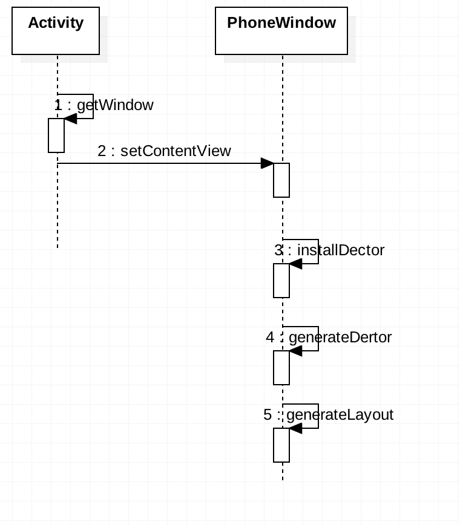
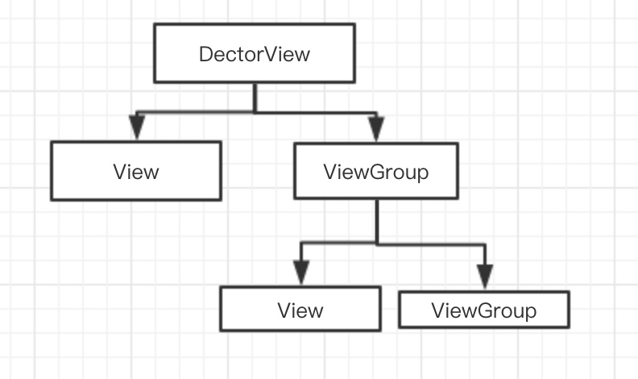

# 时序图



# 关键方法分析

先说下 DecorView 是什么东西，本质上就是一个ViewGroup。



## PhoneWindow 的入口


```

 public void setContentView(int layoutResID) {

        if (mContentParent == null) {
            installDecor();
        } else if (!hasFeature(FEATURE_CONTENT_TRANSITIONS)) {
            mContentParent.removeAllViews();
        }

        if (hasFeature(FEATURE_CONTENT_TRANSITIONS)) {
        。。。
        } else {
            mLayoutInflater.inflate(layoutResID, mContentParent);
        }
        mContentParent.requestApplyInsets();
        final Callback cb = getCallback();
        if (cb != null && !isDestroyed()) {
            cb.onContentChanged();
        }
        mContentParentExplicitlySet = true;
    }
```

此函数分为2部分

* 创建 DecorView
* 解析 View

值得关注的是 mContentParent 就是  generateLayout 函数的返回值，

```
 private void installDecor() {
        mForceDecorInstall = false;
        if (mDecor == null) {
        //Activity刚创建的时候，meDecotr是为null的， 所以进入generateDecor 创建一个 
        //DecorView,并且 
            mDecor = generateDecor(-1)；
            。。。代码省略。。。
                
        }
        //因为是初始化，所以 mContentParent 也为空，执行关键方法 generateLayout
        if (mContentParent == null) {
            mContentParent = generateLayout(mDecor);
            mDecor.makeOptionalFitsSystemWindows();

            final DecorContentParent decorContentParent = (DecorContentParent) mDecor.findViewById(
                    R.id.decor_content_parent);

         
            }
```
此处最关键的是执行了 generateDector 和 generateLayout ，前者是创建一个 DecorView ，后者是对 DecorView 设置属性。先看 generateDector 方法

```
  protected DecorView generateDecor(int featureId) {

        Context context;
        if (mUseDecorContext) {
            Context applicationContext = getContext().getApplicationContext();
            if (applicationContext == null) {
                context = getContext();
            } else {
                context = new DecorContext(applicationContext, getContext().getResources());
                if (mTheme != -1) {
                    context.setTheme(mTheme);
                }
            }
        } else {
            context = getContext();
        }
        return new DecorView(context, featureId, this, getAttributes());
    }

```

此方法只是创建了一个 DecorView 并被 PhoneWindow 持有，变量名为 mDector。

generateLayout 方法主要目的是给 mDector 设置属性，比如

* 设置浮动窗口
* 设置输入法
* 设置窗口动画
* 设置加载视图

还有一个重要功能是加载视图

```
 protected ViewGroup generateLayout(DecorView decor) {
        // Apply data from current theme.

        TypedArray a = getWindowStyle();

        //省略代码...
        mDecor.startChanging();
        //此处在在源码中有修改。
        mDecor.onResourcesLoaded(mLayoutInflater, layoutResource);

        ViewGroup contentParent = (ViewGroup)findViewById(ID_ANDROID_CONTENT);
        //省略代码...

        return contentParent;
    }

```

```
        mDecor.onResourcesLoaded(mLayoutInflater, layoutResource);

```
这段是高版本才出现的，在Android 6.0 上面是这么写的

```
        View in = mLayoutInflater.inflate(layoutResource, null);
        decor.addView(in, new ViewGroup.LayoutParams(MATCH_PARENT, MATCH_PARENT));
        mContentRoot = (ViewGroup) in;

        ViewGroup contentParent = (ViewGroup)findViewById(ID_ANDROID_CONTENT);
```
仅是一个绑定的过程，顺带也分析一下高版本的写法吧，其实原理还是一样的，多了一些新的业务逻辑，具体是啥我也不太清楚：）

```
 void onResourcesLoaded(LayoutInflater inflater, int layoutResource) {
        mStackId = getStackId();

        if (mBackdropFrameRenderer != null) {
            loadBackgroundDrawablesIfNeeded();
            mBackdropFrameRenderer.onResourcesLoaded(
                    this, mResizingBackgroundDrawable, mCaptionBackgroundDrawable,
                    mUserCaptionBackgroundDrawable, getCurrentColor(mStatusColorViewState),
                    getCurrentColor(mNavigationColorViewState));
        }

        mDecorCaptionView = createDecorCaptionView(inflater);
        final View root = inflater.inflate(layoutResource, null);
        if (mDecorCaptionView != null) {
            if (mDecorCaptionView.getParent() == null) {
                addView(mDecorCaptionView,
                        new ViewGroup.LayoutParams(MATCH_PARENT, MATCH_PARENT));
            }
            mDecorCaptionView.addView(root,
                    new ViewGroup.MarginLayoutParams(MATCH_PARENT, MATCH_PARENT));
        } else {

            // Put it below the color views.
            addView(root, 0, new ViewGroup.LayoutParams(MATCH_PARENT, MATCH_PARENT));
        }
        mContentRoot = (ViewGroup) root;
        initializeElevation();
    }
```

 到了这边，还是没有出现 ViewRootImpl 的创建，可能你比较困惑的是 addView 会不会去执行 ViewRootImpl 的 requestLayout,，事实上是不会的，此方法是在讲资源信息的内容添加到 mDector中，讲了这么多我们只是创建了一个DecorView而已并且设置了DecorView的属性，连我们自定义的布局信息都还没塞入 DecorView 中，解析 Xml ，使用深度优先遍历生成 View 树的过程是在 下面代码实现的
 
```
LayoutInflater.from(mContext).inflate(R.layout.item_main，null);
```


