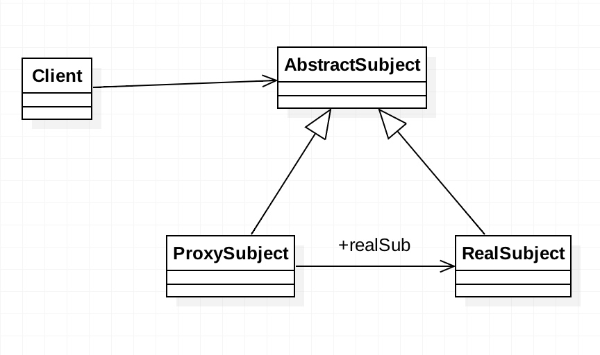

# 前言
如果要彻底掌握 Binder 机制的话，涉及到非常多的知识点，而且多数内容是在 Linux 层的，所以此篇文章仅是介绍代理设计模式如何在 Binder 中使用的。
#代理设计模式
## 定义
为其他对象提供一种代理以控制对这个对象的访问
## 类型
###编码类型
* 静态代理
* 动态代理：Java 提供了一个便捷的动态代理接口 InvocationHandler。

### 功能类型
* 远程代理：为某个对象在不同的内存地址空间提供局部代理
* 虚拟代理：使用一个代理对象表示一个十分耗资源的对象，并在合适的时候创建
* 安全代理：

##UML

## 解析
* AbstractSubject 抽象主题类
* RealSubject 具体主题类
* ProxySubject 代理类，通过 realSub 方法关联了具体主题类

