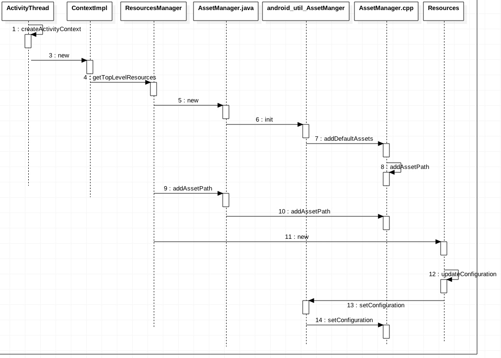
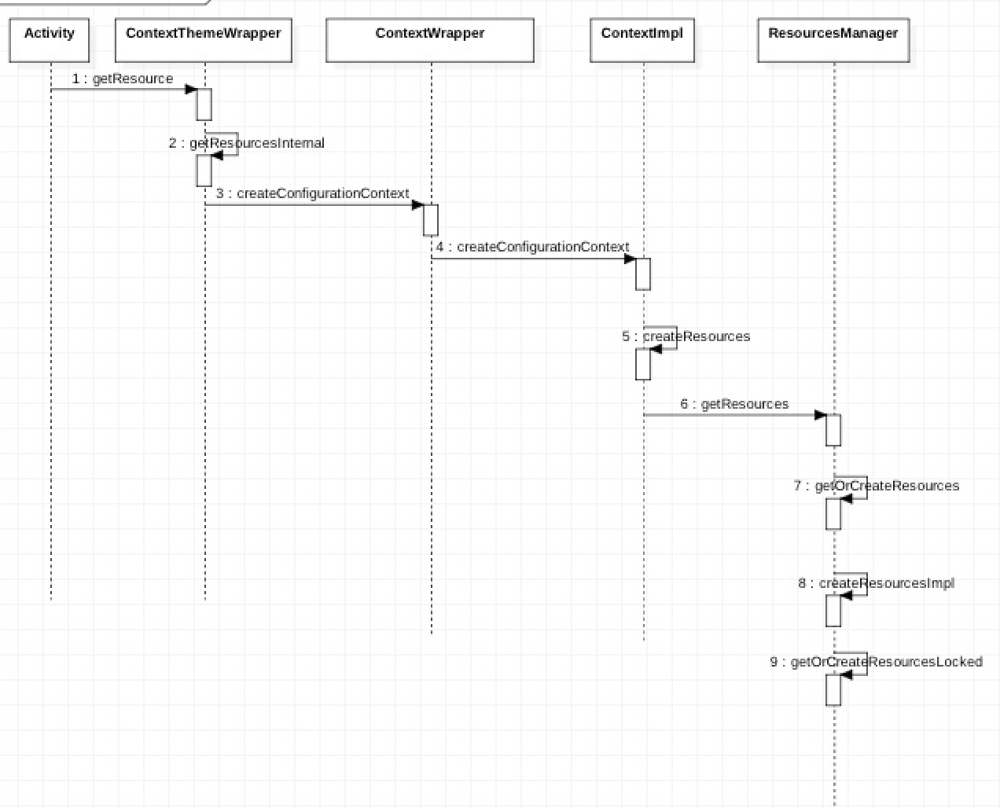
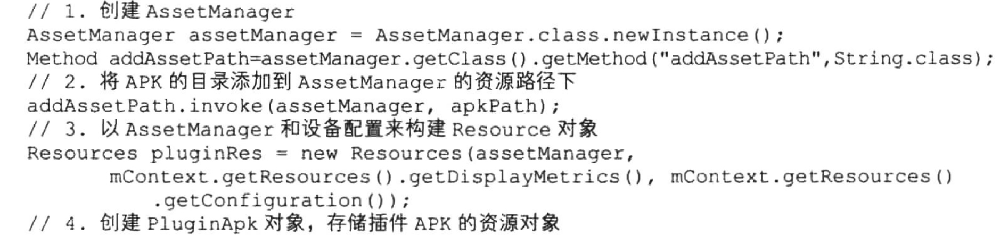
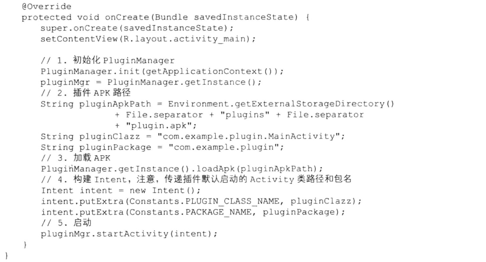
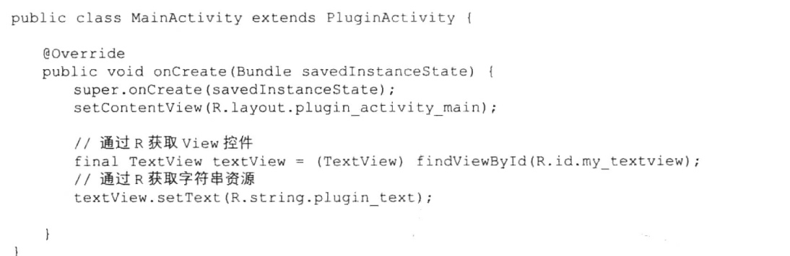

# 前言
Android 应用程序资源编译和打包之后就生成一个资源索引文件 resource.arsc,这个应用程序资源会被打包到 APK 中，Android 应用程序运行过程中，通过一个称为 Resource 来获取资源，但本质上 Resource 内部是通过 ResourceManager，再通过 AssetManager 的资源管理器来读取打包在 APK 里的文件。

# 时序图
## AssetManager 初始化


## 调用 AssetManager



# 关键步骤分析
1.在此处进行了 ContextImpl 的创建
3.ContextImpl 的构造法中实现了 Resource 的创建，并被 mResources 持有
4.核心方法，根据 APK 路径、屏幕 id 等生成一个资源 key，根据这个 key 查看是否有缓存好的 Resource ，如果没有则新建。

```
Resources getTopLevelResources(String resDir, String[] splitResDirs,
            String[] overlayDirs, String[] libDirs, int displayId,
            Configuration overrideConfiguration, CompatibilityInfo compatInfo) {
        final float scale = compatInfo.applicationScale;
        Configuration overrideConfigCopy = (overrideConfiguration != null)
                ? new Configuration(overrideConfiguration) : null;
        ResourcesKey key = new ResourcesKey(resDir, displayId, overrideConfigCopy, scale);
        Resources r;

        //判断是否已经加载资源
        synchronized (this) {
            // Resources is app scale dependent.
            if (DEBUG) Slog.w(TAG, "getTopLevelResources: " + resDir + " / " + scale);

            WeakReference<Resources> wr = mActiveResources.get(key);
            r = wr != null ? wr.get() : null;
            if (r != null && r.getAssets().isUpToDate()) {
                return r;
            }
        }

        //创建 AssetManager

        AssetManager assets = new AssetManager();
       
        if (resDir != null) {
            if (assets.addAssetPath(resDir) == 0) {
                return null;
            }
        }
        // 将 APK 路径添加到 AssetManager 的资源路径中
        if (splitResDirs != null) {
            for (String splitResDir : splitResDirs) {
                if (assets.addAssetPath(splitResDir) == 0) {
                    return null;
                }
            }
        }

        if (overlayDirs != null) {
            for (String idmapPath : overlayDirs) {
                assets.addOverlayPath(idmapPath);
            }
        }

        //Log.i(TAG, "Resource: key=" + key + ", display metrics=" + metrics);
        DisplayMetrics dm = getDisplayMetricsLocked(displayId);
        Configuration config;
        final boolean isDefaultDisplay = (displayId == Display.DEFAULT_DISPLAY);
        final boolean hasOverrideConfig = key.hasOverrideConfiguration();
        if (!isDefaultDisplay || hasOverrideConfig) {
            config = new Configuration(getConfiguration());
            if (!isDefaultDisplay) {
                applyNonDefaultDisplayMetricsToConfigurationLocked(dm, config);
            }
            if (hasOverrideConfig) {
                config.updateFrom(key.mOverrideConfiguration);
                if (DEBUG) Slog.v(TAG, "Applied overrideConfig=" + key.mOverrideConfiguration);
            }
        } else {
            config = getConfiguration();
        }
        //创建资源
        r = new Resources(assets, dm, config, compatInfo);
        if (DEBUG) Slog.i(TAG, "Created app resources " + resDir + " " + r + ": "
                + r.getConfiguration() + " appScale=" + r.getCompatibilityInfo().applicationScale);
        //缓存资源
        synchronized (this) {
            WeakReference<Resources> wr = mActiveResources.get(key);
            Resources existing = wr != null ? wr.get() : null;
            if (existing != null && existing.getAssets().isUpToDate()) {
                // Someone else already created the resources while we were
                // unlocked; go ahead and use theirs.
                r.getAssets().close();
                return existing;
            }

            // XXX need to remove entries when weak references go away
            mActiveResources.put(key, new WeakReference<>(r));
            if (DEBUG) Slog.v(TAG, "mActiveResources.size()=" + mActiveResources.size());
            return r;
        }
    }
```

5.构建 ResourceManager 的时候，会执行 init 方法，此方法会进入到 Native 层。
6.在 Native 层的 init 方法中，会创建一个 Native 层的 AssetManager 对象，并且添加默认的系统资源，而且还会将这个 AssetManager 对象转换为整形并且传递到 Java 层的 AssetManager 的 mObject 中，这样 Java 层级就相当于持有了一个 Native 层AssetManager 的句柄。

```
static void android_content_AssetManager_init(JNIEnv* env, jobject clazz, jboolean isSystem)
{
    if (isSystem) {
        verifySystemIdmaps();
    }
    AssetManager* am = new AssetManager();
    if (am == NULL) {
        jniThrowException(env, "java/lang/OutOfMemoryError", "");
        return;
    }

    am->addDefaultAssets();

    ALOGV("Created AssetManager %p for Java object %p\n", am, clazz);
    env->SetLongField(clazz, gAssetManagerOffsets.mObject, reinterpret_cast<jlong>(am));
}

```
7.接着看这个方法，主要作用是拼接路径，路径=系统路径+资源 APK 路径。

```
static const char* kSystemAssets = "framework/framework-res.apk";

bool AssetManager::addDefaultAssets()
{
    const char* root = getenv("ANDROID_ROOT");
    LOG_ALWAYS_FATAL_IF(root == NULL, "ANDROID_ROOT not set");

    String8 path(root);
    path.appendPath(kSystemAssets);

    return addAssetPath(path, NULL);
}

```

8.拼接完整的路径后，把系统资源路径添加到 AssetManager.cpp 的资源路径列表中，到此处总算把 AssetManager 的创建完成，所以这个时候 Java 层的 AssetManager 和 Native 层的 AssetManager 是建立起联系的。当然我们还差一个把 apk 的资源信息放到资源表中。

9.此方法的参数 splitResDir 必须是一个目录或者是一个 zip 文件，会进一步执行到 Native 的 addAssetPath 函数。

10.在此函数中，先去拿 Java 层的 mObject 变量，这个变量持有之前创建的 Native 层 AssetManager 的句柄，然后将 APK 的路径也添加到此资源路径列表中。这样 AssetManager 就有了应用本身的系统资源了。

12-14.在创建 Resource 的时候，会把之前的 AssetManger 也传进去，并且会执行 updateConfiguration ，对 AssetManger 进行初始化配置，本质还是关联到 Native 层的 AssetManager 中，这样当我们通过 getResource 的时候，Native 层就会根据中国配置信息寻找最合适的资源返回，从而达到多屏幕适配的效果。

```
 public void updateConfiguration(Configuration config,
            DisplayMetrics metrics, CompatibilityInfo compat) {
        synchronized (mAccessLock) {
            if (false) {
            if (compat != null) {
                mCompatibilityInfo = compat;
            }
            // 绑定屏幕信息
            if (metrics != null) {
                mMetrics.setTo(metrics);
            }
       
            mCompatibilityInfo.applyToDisplayMetrics(mMetrics);

            final int configChanges = calcConfigChanges(config);
            if (mConfiguration.locale == null) {
                mConfiguration.locale = Locale.getDefault();
                mConfiguration.setLayoutDirection(mConfiguration.locale);
            }
            // 设置设备 DPI
            if (mConfiguration.densityDpi != Configuration.DENSITY_DPI_UNDEFINED) {
                mMetrics.densityDpi = mConfiguration.densityDpi;
                mMetrics.density = mConfiguration.densityDpi * DisplayMetrics.DENSITY_DEFAULT_SCALE;
            }
            mMetrics.scaledDensity = mMetrics.density * mConfiguration.fontScale;

            String locale = null;
            if (mConfiguration.locale != null) {
                locale = adjustLanguageTag(mConfiguration.locale.toLanguageTag());
            }
            //获取屏幕宽高
            final int width, height;
            if (mMetrics.widthPixels >= mMetrics.heightPixels) {
                width = mMetrics.widthPixels;
                height = mMetrics.heightPixels;
            } else {
                //noinspection SuspiciousNameCombination
                width = mMetrics.heightPixels;
                //noinspection SuspiciousNameCombination
                height = mMetrics.widthPixels;
            }
            //设置输入键盘
            final int keyboardHidden;
            if (mConfiguration.keyboardHidden == Configuration.KEYBOARDHIDDEN_NO
                    && mConfiguration.hardKeyboardHidden == Configuration.HARDKEYBOARDHIDDEN_YES) {
                keyboardHidden = Configuration.KEYBOARDHIDDEN_SOFT;
            } else {
                keyboardHidden = mConfiguration.keyboardHidden;
            }
            //初始化 AssetManager
            mAssets.setConfiguration(mConfiguration.mcc, mConfiguration.mnc,
                    locale, mConfiguration.orientation,
                    mConfiguration.touchscreen,
                    mConfiguration.densityDpi, mConfiguration.keyboard,
                    keyboardHidden, mConfiguration.navigation, width, height,
                    mConfiguration.smallestScreenWidthDp,
                    mConfiguration.screenWidthDp, mConfiguration.screenHeightDp,
                    mConfiguration.screenLayout, mConfiguration.uiMode,
                    Build.VERSION.RESOURCES_SDK_INT);

            flushLayoutCache();
        }
    
    }
    
```

# 延伸
1. 在 7.0 之前，一个进程只有一个 Resource 对象；7.0之后，一个进行有多个 Resource 对象，其中每个 Activity 对应一个，而 ResourceImpl 对象和 AssetManager 只有一个，大家公用。

2. 通过 assets.addAssetPath 函数我们可以得出应用的资源是存放在 APK 中的，一个 AssetManager 可以管理多个 APK 的资源路径，因为内部是使用一个列表来管理资源路径的，利润上可以一直 add apkPath，通过 Resource 可以拿到具体的 AssetManager，理论上来说我们可以通过 AssetManager 的 addAssetPath 的方法加载 APK 的资源达到一个动态加载的过程，也可以实现换肤的功能。
 

此处的 pluginRes 就是目标 APK 的 Resource，通过 pluginRes 就可以获目标的所有资源文件了。下例是一个具体的使用
调用方的入口


插件方的结果页



