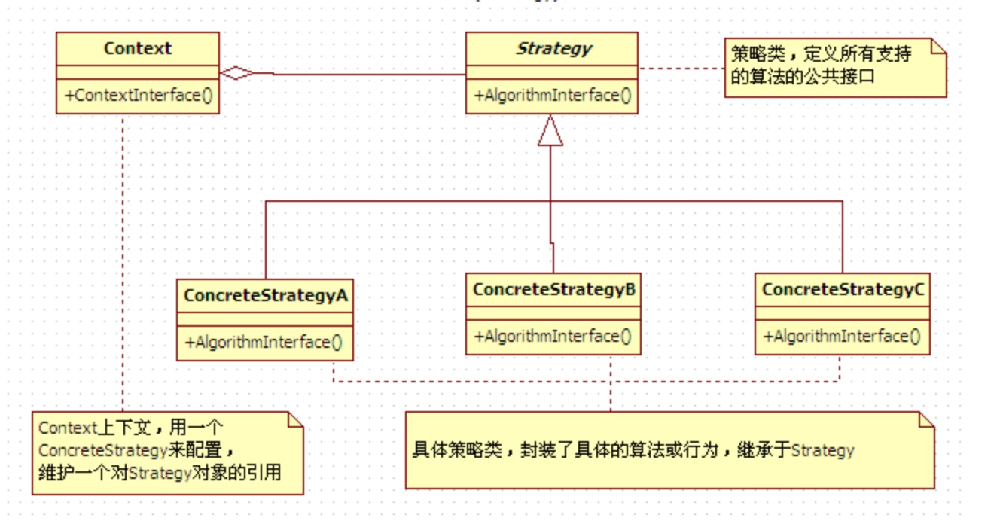
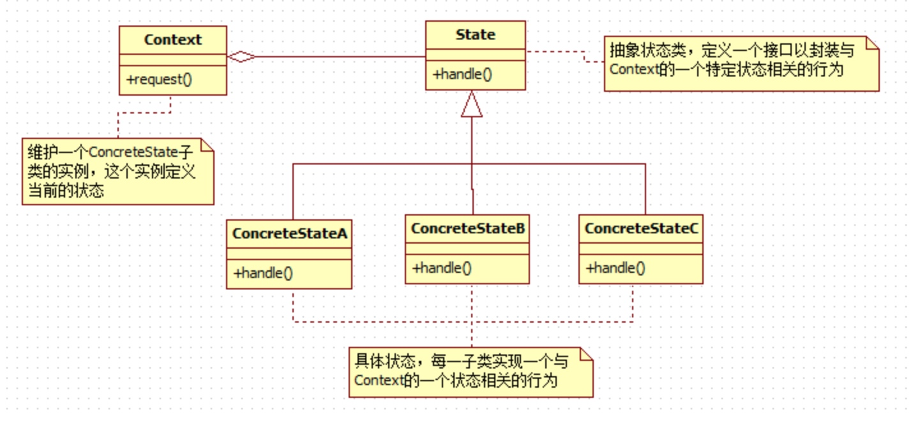

2则非常的类似，都是把不同的情形抽象成统一的接口来实现，放在一起记录，最大区别是状态模式需要在子类实现与 context 相关的状态类。

使用场景

* 状态模式是状态之间的切换，在状态 A 执行完后自己控制状态指向状态 B，状态模式是不停的切换状态执行的。当一个对象的行为取决于它的状态时，并且必须在运行时，根据状态改变它的行为时使用。而且状态模式需要维护状态层级，建立层级关系
* 策略模式是考虑多种不同的业务规则将不同的算法进行分装，便于调用者选择，策略模式只会让条件选择一次。

本质区别

状态模式的类图和策略模式类似，并且都是能够动态改变对象的行为。但是状态模式是通过状态转移来改变 Context 所组合的 State 对象，而策略模式是通过 Context 本身的决策来改变组合的 Strategy 对象。

# 策略模式

#状态模式

