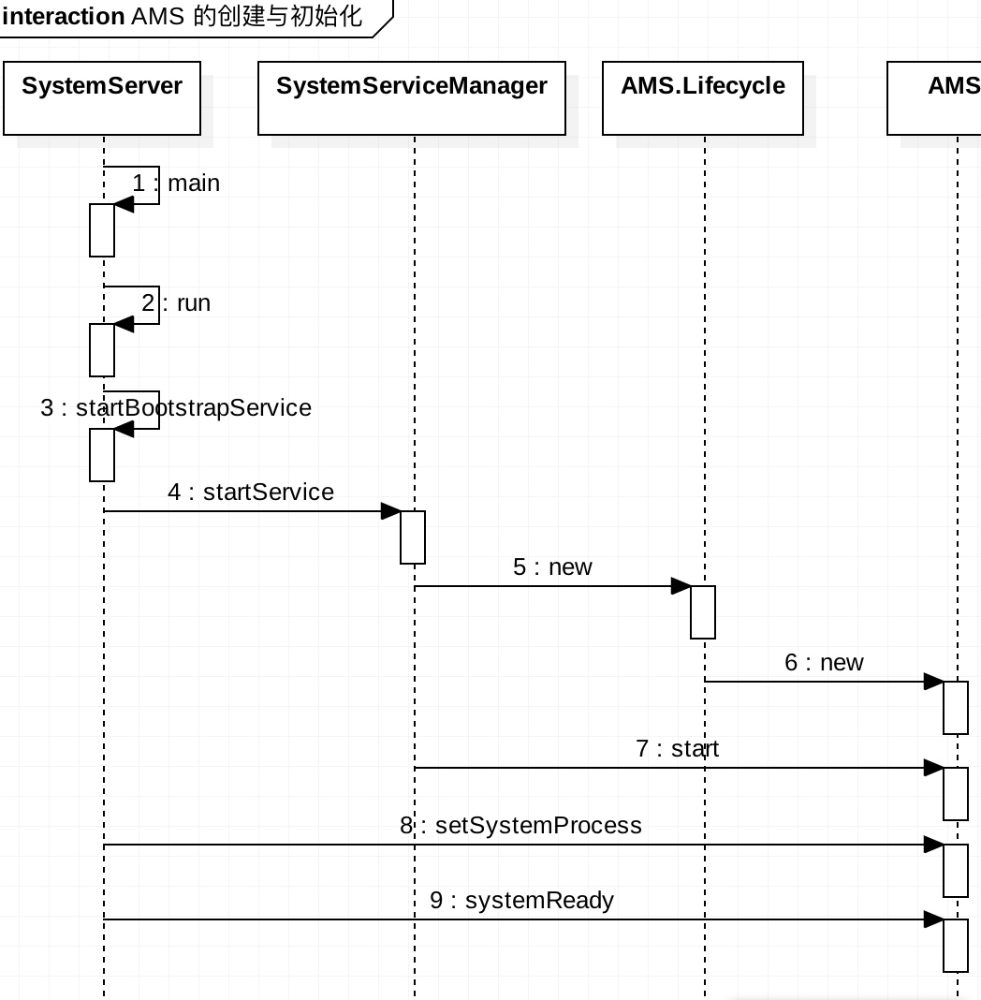

# 前言
在说道 AMS 的创建时候，不得不提一句 SystemServer 服务，他是有 Zygote 创建的，也是 Zygote 孵化的第一个进程，当 SystemServer 启动后会执行 main()->run()，Android 系统的核心服务(AMS,WMS,PMS 等)正是在 run 方法创建和初始化的。

# 时序图


# 重要步骤梳理

 
 在 SystemServer 中，startBootstrapService 这个方法是一个非常重要的方法，在这个方法中启动 Installer 服务、启动了 LightService 服务等
 
## AMS 创建
  
 如上述，AMS 的创建是在 startBootstrapService 执行的，首先调用 startService 方法来创建 AMS 对象
 
 SystemServer.java
 
```
 // Activity manager runs the show.
        mActivityManagerService = mSystemServiceManager.startService(
                ActivityManagerService.Lifecycle.class).getService();
```

此处的 mActivityManagerService 就是我们的 AMS 了。

SystemServiceManager.java

```

  public <T extends SystemService> T startService(Class<T> serviceClass) {
        final String name = serviceClass.getName();
        Slog.i(TAG, "Starting " + name);

        // Create the service.
        if (!SystemService.class.isAssignableFrom(serviceClass)) {
            throw new RuntimeException("Failed to create " + name
                    + ": service must extend " + SystemService.class.getName());
        }
        final T service;
        try {
            Constructor<T> constructor = serviceClass.getConstructor(Context.class);
            service = constructor.newInstance(mContext);
        } 
....
        // Register it.
        mServices.add(service);

        // Start it.
        try {
            service.onStart();
        } catch (RuntimeException ex) {
            throw new RuntimeException("Failed to start service " + name
                    + ": onStart threw an exception", ex);
        }
        return service;
    }

```

根据之前传入的 AMS.Lifecycle 参数。本质是创建在 Lifecycle 的内部类，在这个内部类中才是 new AMS 的地方。

```
  public static final class Lifecycle extends SystemService {
        private final ActivityManagerService mService;

        public Lifecycle(Context context) {
            super(context);
            mService = new ActivityManagerService(context);
        }

        @Override
        public void onStart() {
            mService.start();
        }

        public ActivityManagerService getService() {
            return mService;
        }
    }

```

## 初始化

而初始化是在在 SystemServer 中调用了 setSystemProcess 方法


AMS.java 

```
 public void setSystemProcess() {
        try {
            ServiceManager.addService(Context.ACTIVITY_SERVICE, this, true);
            ServiceManager.addService(ProcessStats.SERVICE_NAME, mProcessStats);
            ServiceManager.addService("meminfo", new MemBinder(this));
            ServiceManager.addService("gfxinfo", new GraphicsBinder(this));
            ServiceManager.addService("dbinfo", new DbBinder(this));
            if (MONITOR_CPU_USAGE) {
                ServiceManager.addService("cpuinfo", new CpuBinder(this));
            }
            ServiceManager.addService("permission", new PermissionController(this));
            ServiceManager.addService("processinfo", new ProcessInfoService(this));

            ApplicationInfo info = mContext.getPackageManager().getApplicationInfo(
                    "android", STOCK_PM_FLAGS | MATCH_SYSTEM_ONLY);
            mSystemThread.installSystemApplicationInfo(info, getClass().getClassLoader());

            synchronized (this) {
                ProcessRecord app = newProcessRecordLocked(info, info.processName, false, 0);
                app.persistent = true;
                app.pid = MY_PID;
                app.maxAdj = ProcessList.SYSTEM_ADJ;
                app.makeActive(mSystemThread.getApplicationThread(), mProcessStats);
                synchronized (mPidsSelfLocked) {
                    mPidsSelfLocked.put(app.pid, app);
                }
                updateLruProcessLocked(app, false, null);
                updateOomAdjLocked();
            }
        } catch (PackageManager.NameNotFoundException e) {
            throw new RuntimeException(
                    "Unable to find android system package", e);
        }
    }
```
值得注意的是，在初始化的时候我们把 AMS 已经注入到了共享内存中


```
ServiceManager.addService(Context.ACTIVITY_SERVICE, this, true);

```

ServiceManager.java

```
  public static void addService(String name, IBinder service) {
        try {
            getIServiceManager().addService(name, service, false);
        } catch (RemoteException e) {
            Log.e(TAG, "error in addService", e);
        }
    }
    
    
       private static IServiceManager getIServiceManager() {
        if (sServiceManager != null) {
            return sServiceManager;
        }

        // Find the service manager
        sServiceManager = ServiceManagerNative.asInterface(BinderInternal.getContextObject());
        return sServiceManager;
    }

```

BinderInternal.getContextObject() 就不在展开了，已经到 Native 层了。


## AMS 准备启动 systemReady()

在真正启动的时候，我们需要确保在启动前

1.进行个人信息获取，用于安全检查
2.检查需要 kill 的进程，并保证不在重启
3.启动 manifest 配置了 persistent 的 APP，包名里面带 android 的 app。
4.启动 Launch APP

```
public void systemReady(final Runnable goingCallback, BootTimingsTraceLog traceLog) {
        traceLog.traceBegin("PhaseActivityManagerReady");
        synchronized(this) {
            if (mSystemReady) {
                // If we're done calling all the receivers, run the next "boot phase" passed in
                // by the SystemServer
                if (goingCallback != null) {
                    goingCallback.run();
                }
                return;
            }

            mLocalDeviceIdleController
                    = LocalServices.getService(DeviceIdleController.LocalService.class);
            mAssistUtils = new AssistUtils(mContext);
            mVrController.onSystemReady();
            // Make sure we have the current profile info, since it is needed for security checks.
            mUserController.onSystemReady();
            mRecentTasks.onSystemReadyLocked();
            mAppOpsService.systemReady();
            mSystemReady = true;
        }

        ArrayList<ProcessRecord> procsToKill = null;
        synchronized(mPidsSelfLocked) {
            for (int i=mPidsSelfLocked.size()-1; i>=0; i--) {
                ProcessRecord proc = mPidsSelfLocked.valueAt(i);
                if (!isAllowedWhileBooting(proc.info)){
                    if (procsToKill == null) {
                        procsToKill = new ArrayList<ProcessRecord>();
                    }
                    procsToKill.add(proc);
                }
            }
        }

        synchronized(this) {
            if (procsToKill != null) {
                for (int i=procsToKill.size()-1; i>=0; i--) {
                    ProcessRecord proc = procsToKill.get(i);
                    Slog.i(TAG, "Removing system update proc: " + proc);
                    removeProcessLocked(proc, true, false, "system update done");
                }
            }

            // Now that we have cleaned up any update processes, we
            // are ready to start launching real processes and know that
            // we won't trample on them any more.
            mProcessesReady = true;
        }

        Slog.i(TAG, "System now ready");
        EventLog.writeEvent(EventLogTags.BOOT_PROGRESS_AMS_READY,
            SystemClock.uptimeMillis());

        synchronized(this) {
            // Make sure we have no pre-ready processes sitting around.

            if (mFactoryTest == FactoryTest.FACTORY_TEST_LOW_LEVEL) {
                ResolveInfo ri = mContext.getPackageManager()
                        .resolveActivity(new Intent(Intent.ACTION_FACTORY_TEST),
                                STOCK_PM_FLAGS);
                CharSequence errorMsg = null;
                if (ri != null) {
                    ActivityInfo ai = ri.activityInfo;
                    ApplicationInfo app = ai.applicationInfo;
                    if ((app.flags&ApplicationInfo.FLAG_SYSTEM) != 0) {
                        mTopAction = Intent.ACTION_FACTORY_TEST;
                        mTopData = null;
                        mTopComponent = new ComponentName(app.packageName,
                                ai.name);
                    } else {
                        errorMsg = mContext.getResources().getText(
                                com.android.internal.R.string.factorytest_not_system);
                    }
                } else {
                    errorMsg = mContext.getResources().getText(
                            com.android.internal.R.string.factorytest_no_action);
                }
                if (errorMsg != null) {
                    mTopAction = null;
                    mTopData = null;
                    mTopComponent = null;
                    Message msg = Message.obtain();
                    msg.what = SHOW_FACTORY_ERROR_UI_MSG;
                    msg.getData().putCharSequence("msg", errorMsg);
                    mUiHandler.sendMessage(msg);
                }
            }
        }

        retrieveSettings();
        final int currentUserId;
        synchronized (this) {
            currentUserId = mUserController.getCurrentUserIdLocked();
            readGrantedUriPermissionsLocked();
        }

        if (goingCallback != null) goingCallback.run();
        traceLog.traceBegin("ActivityManagerStartApps");
        mBatteryStatsService.noteEvent(BatteryStats.HistoryItem.EVENT_USER_RUNNING_START,
                Integer.toString(currentUserId), currentUserId);
        mBatteryStatsService.noteEvent(BatteryStats.HistoryItem.EVENT_USER_FOREGROUND_START,
                Integer.toString(currentUserId), currentUserId);
        mSystemServiceManager.startUser(currentUserId);

        synchronized (this) {
            // Only start up encryption-aware persistent apps; once user is
            // unlocked we'll come back around and start unaware apps
            startPersistentApps(PackageManager.MATCH_DIRECT_BOOT_AWARE);

            // 启动 Launch APP
            startHomeActivityLocked(currentUserId, "systemReady");

    }
```


