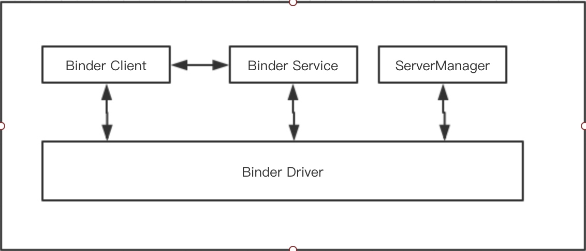

# 背景
跨进程的通信方式有很多，比如 Socket,信号量,管道,内存共享,消息队列等，传统的通信机制安全性脚底，大部分情况下接收方无法获得可靠地消息来源，所以 Android 中的 Binder 就应用而生了。
# 四大模块

Binder 涉及到四大模块，分为

* Binder Client 相当于客户端
* Binder Server 相当于服务器
* ServerManager 相当于 DNS 服务器
* Binder Driver 相当于路由容器

## Binder Driver
 位于内核中，主要负责 Binder 通信的建立以及其在进程间的传递和 Binder 引用计数管理/数据报的传输等。其以字符设备中的 misc 类型注册，用户可以从 /dev/binder 身上文件节点上，通过 open 和 ioctl 文件操作函数与 Binder Driver 进行通信。在此处统一处理分发 Binder Client 与 Binder Server 的跨进程通信。
## Binder Client 
位于用户空间，需要知道 Binder 的名字以及该 Binder 实体在 ServerManager 中的0号引用。 Client 先通过0号引用去访问 ServerManager 获取该 Binder 的引用，得到饮用后即可正常使用 Binder 实体了
## Binder Service 
由 C 来实现，所对应的文件为 service_manager.c 
## ServerManager
位于用户空间，本质也是一个标准的 Binder Server ，并且在 Android 系统中约定其在 Binder 通信的过程中唯一识别码永远为**0**。
Binder Driver 会将 Client 和 Server 持有的引用传递到 ServerManager。

# AIDL 
## 来源
整个 Binder 由以上4块组成，而 Binder Driver 和 ServerManager 均在底层已经实现，我们只需要实现 Binder Client 和 Binder Server ，而 Binder Server 是由 C 来实现的，对开发者来说有一定的挑战性，所以 Android 系统提供了一种简单的方式来生成 Binder Server，名字叫 Android Interface Description Language，简称 AIDL

