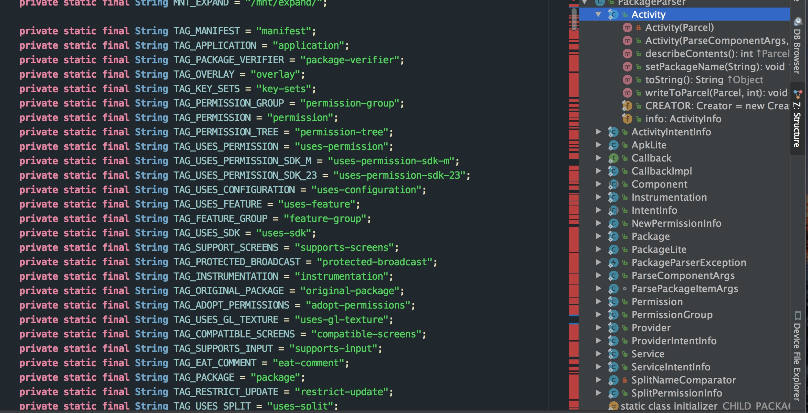

# 解析
在 AndroidManifest 文件中，可以当做是一种特殊的语言表达式，而解析这类特殊的表达式，在这里面体现了一种设计模式-解析器设计模式。
在读取此文件的过程中，不得不说到 PackParser 类，该类对 AndroidManifest 中每一个组件的标签创建了相应的类用以存储相应的信息。

# 局部代码图



PackParser 为 Activity、Service、Provider、Permission 等构建的内部类，按照解析器模式的定义，这些类都对应 AndroidManifest 文件中的标签。

# 具体解析
在 Android 中，解析某个 APK 文件斗都会调用 PMS 的 scanPackageLI 方法

```
    /**
     *  Scans a package and returns the newly parsed package.
     *  @throws PackageManagerException on a parse error.
     */
    private PackageParser.Package scanPackageLI(PackageParser.Package pkg, File scanFile,
            final int policyFlags, int scanFlags, long currentTime, @Nullable UserHandle user)
            throws PackageManagerException {
        // If the package has children and this is the first dive in the function
        // we scan the package with the SCAN_CHECK_ONLY flag set to see whether all
        // packages (parent and children) would be successfully scanned before the
        // actual scan since scanning mutates internal state and we want to atomically
        // install the package and its children.
        if ((scanFlags & SCAN_CHECK_ONLY) == 0) {
            if (pkg.childPackages != null && pkg.childPackages.size() > 0) {
                scanFlags |= SCAN_CHECK_ONLY;
            }
        } else {
            scanFlags &= ~SCAN_CHECK_ONLY;
        }

        // Scan the parent
        PackageParser.Package scannedPkg = scanPackageInternalLI(pkg, scanFile, policyFlags,
                scanFlags, currentTime, user);

        // Scan the children
        final int childCount = (pkg.childPackages != null) ? pkg.childPackages.size() : 0;
        for (int i = 0; i < childCount; i++) {
            PackageParser.Package childPackage = pkg.childPackages.get(i);
            scanPackageInternalLI(childPackage, scanFile, policyFlags, scanFlags,
                    currentTime, user);
        }


        if ((scanFlags & SCAN_CHECK_ONLY) != 0) {
            return scanPackageLI(pkg, scanFile, policyFlags, scanFlags, currentTime, user);
        }

        return scannedPkg;
    }

    /**
     *  Scans a package and returns the newly parsed package.
     *  @throws PackageManagerException on a parse error.
     */
    private PackageParser.Package scanPackageInternalLI(PackageParser.Package pkg, File scanFile,
            int policyFlags, int scanFlags, long currentTime, @Nullable UserHandle user)
            throws PackageManagerException {
        PackageSetting ps = null;
        PackageSetting updatedPkg;
        // reader
        synchronized (mPackages) {
            // Look to see if we already know about this package.
            String oldName = mSettings.getRenamedPackageLPr(pkg.packageName);
            if (pkg.mOriginalPackages != null && pkg.mOriginalPackages.contains(oldName)) {
                // This package has been renamed to its original name.  Let's
                // use that.
                ps = mSettings.getPackageLPr(oldName);
            }
            // If there was no original package, see one for the real package name.
            if (ps == null) {
                ps = mSettings.getPackageLPr(pkg.packageName);
            }
            // Check to see if this package could be hiding/updating a system
            // package.  Must look for it either under the original or real
            // package name depending on our state.
            updatedPkg = mSettings.getDisabledSystemPkgLPr(ps != null ? ps.name : pkg.packageName);
            if (DEBUG_INSTALL && updatedPkg != null) Slog.d(TAG, "updatedPkg = " + updatedPkg);

            // If this is a package we don't know about on the system partition, we
            // may need to remove disabled child packages on the system partition
            // or may need to not add child packages if the parent apk is updated
            // on the data partition and no longer defines this child package.
            if ((policyFlags & PackageParser.PARSE_IS_SYSTEM) != 0) {
                // If this is a parent package for an updated system app and this system
                // app got an OTA update which no longer defines some of the child packages
                // we have to prune them from the disabled system packages.
                PackageSetting disabledPs = mSettings.getDisabledSystemPkgLPr(pkg.packageName);
                if (disabledPs != null) {
                    final int scannedChildCount = (pkg.childPackages != null)
                            ? pkg.childPackages.size() : 0;
                    final int disabledChildCount = disabledPs.childPackageNames != null
                            ? disabledPs.childPackageNames.size() : 0;
                    for (int i = 0; i < disabledChildCount; i++) {
                        String disabledChildPackageName = disabledPs.childPackageNames.get(i);
                        boolean disabledPackageAvailable = false;
                        for (int j = 0; j < scannedChildCount; j++) {
                            PackageParser.Package childPkg = pkg.childPackages.get(j);
                            if (childPkg.packageName.equals(disabledChildPackageName)) {
                                disabledPackageAvailable = true;
                                break;
                            }
                         }
                         if (!disabledPackageAvailable) {
                             mSettings.removeDisabledSystemPackageLPw(disabledChildPackageName);
                         }
                    }
                }
            }
        }

        boolean updatedPkgBetter = false;
        // First check if this is a system package that may involve an update
        if (updatedPkg != null && (policyFlags & PackageParser.PARSE_IS_SYSTEM) != 0) {
            // If new package is not located in "/system/priv-app" (e.g. due to an OTA),
            // it needs to drop FLAG_PRIVILEGED.
            if (locationIsPrivileged(scanFile)) {
                updatedPkg.pkgPrivateFlags |= ApplicationInfo.PRIVATE_FLAG_PRIVILEGED;
            } else {
                updatedPkg.pkgPrivateFlags &= ~ApplicationInfo.PRIVATE_FLAG_PRIVILEGED;
            }

            if (ps != null && !ps.codePath.equals(scanFile)) {
                // The path has changed from what was last scanned...  check the
                // version of the new path against what we have stored to determine
                // what to do.
                if (DEBUG_INSTALL) Slog.d(TAG, "Path changing from " + ps.codePath);
                if (pkg.mVersionCode <= ps.versionCode) {
                    // The system package has been updated and the code path does not match
                    // Ignore entry. Skip it.
                    if (DEBUG_INSTALL) Slog.i(TAG, "Package " + ps.name + " at " + scanFile
                            + " ignored: updated version " + ps.versionCode
                            + " better than this " + pkg.mVersionCode);
                    if (!updatedPkg.codePath.equals(scanFile)) {
                        Slog.w(PackageManagerService.TAG, "Code path for hidden system pkg "
                                + ps.name + " changing from " + updatedPkg.codePathString
                                + " to " + scanFile);
                        updatedPkg.codePath = scanFile;
                        updatedPkg.codePathString = scanFile.toString();
                        updatedPkg.resourcePath = scanFile;
                        updatedPkg.resourcePathString = scanFile.toString();
                    }
                    updatedPkg.pkg = pkg;
                    updatedPkg.versionCode = pkg.mVersionCode;

                    // Update the disabled system child packages to point to the package too.
                    final int childCount = updatedPkg.childPackageNames != null
                            ? updatedPkg.childPackageNames.size() : 0;
                    for (int i = 0; i < childCount; i++) {
                        String childPackageName = updatedPkg.childPackageNames.get(i);
                        PackageSetting updatedChildPkg = mSettings.getDisabledSystemPkgLPr(
                                childPackageName);
                        if (updatedChildPkg != null) {
                            updatedChildPkg.pkg = pkg;
                            updatedChildPkg.versionCode = pkg.mVersionCode;
                        }
                    }

                    throw new PackageManagerException(Log.WARN, "Package " + ps.name + " at "
                            + scanFile + " ignored: updated version " + ps.versionCode
                            + " better than this " + pkg.mVersionCode);
                } else {
                    // The current app on the system partition is better than
                    // what we have updated to on the data partition; switch
                    // back to the system partition version.
                    // At this point, its safely assumed that package installation for
                    // apps in system partition will go through. If not there won't be a working
                    // version of the app
                    // writer
                    synchronized (mPackages) {
                        // Just remove the loaded entries from package lists.
                        mPackages.remove(ps.name);
                    }

                    logCriticalInfo(Log.WARN, "Package " + ps.name + " at " + scanFile
                            + " reverting from " + ps.codePathString
                            + ": new version " + pkg.mVersionCode
                            + " better than installed " + ps.versionCode);

                    InstallArgs args = createInstallArgsForExisting(packageFlagsToInstallFlags(ps),
                            ps.codePathString, ps.resourcePathString, getAppDexInstructionSets(ps));
                    synchronized (mInstallLock) {
                        args.cleanUpResourcesLI();
                    }
                    synchronized (mPackages) {
                        mSettings.enableSystemPackageLPw(ps.name);
                    }
                    updatedPkgBetter = true;
                }
            }
        }

        if (updatedPkg != null) {
            // An updated system app will not have the PARSE_IS_SYSTEM flag set
            // initially
            policyFlags |= PackageParser.PARSE_IS_SYSTEM;

            // An updated privileged app will not have the PARSE_IS_PRIVILEGED
            // flag set initially
            if ((updatedPkg.pkgPrivateFlags & ApplicationInfo.PRIVATE_FLAG_PRIVILEGED) != 0) {
                policyFlags |= PackageParser.PARSE_IS_PRIVILEGED;
            }
        }

        // Verify certificates against what was last scanned
        collectCertificatesLI(ps, pkg, scanFile, policyFlags);

        /*
         * A new system app appeared, but we already had a non-system one of the
         * same name installed earlier.
         */
        boolean shouldHideSystemApp = false;
        if (updatedPkg == null && ps != null
                && (policyFlags & PackageParser.PARSE_IS_SYSTEM_DIR) != 0 && !isSystemApp(ps)) {
            /*
             * Check to make sure the signatures match first. If they don't,
             * wipe the installed application and its data.
             */
            if (compareSignatures(ps.signatures.mSignatures, pkg.mSignatures)
                    != PackageManager.SIGNATURE_MATCH) {
                logCriticalInfo(Log.WARN, "Package " + ps.name + " appeared on system, but"
                        + " signatures don't match existing userdata copy; removing");
                try (PackageFreezer freezer = freezePackage(pkg.packageName,
                        "scanPackageInternalLI")) {
                    deletePackageLIF(pkg.packageName, null, true, null, 0, null, false, null);
                }
                ps = null;
            } else {
                /*
                 * If the newly-added system app is an older version than the
                 * already installed version, hide it. It will be scanned later
                 * and re-added like an update.
                 */
                if (pkg.mVersionCode <= ps.versionCode) {
                    shouldHideSystemApp = true;
                    logCriticalInfo(Log.INFO, "Package " + ps.name + " appeared at " + scanFile
                            + " but new version " + pkg.mVersionCode + " better than installed "
                            + ps.versionCode + "; hiding system");
                } else {
                    /*
                     * The newly found system app is a newer version that the
                     * one previously installed. Simply remove the
                     * already-installed application and replace it with our own
                     * while keeping the application data.
                     */
                    logCriticalInfo(Log.WARN, "Package " + ps.name + " at " + scanFile
                            + " reverting from " + ps.codePathString + ": new version "
                            + pkg.mVersionCode + " better than installed " + ps.versionCode);
                    InstallArgs args = createInstallArgsForExisting(packageFlagsToInstallFlags(ps),
                            ps.codePathString, ps.resourcePathString, getAppDexInstructionSets(ps));
                    synchronized (mInstallLock) {
                        args.cleanUpResourcesLI();
                    }
                }
            }
        }

        // The apk is forward locked (not public) if its code and resources
        // are kept in different files. (except for app in either system or
        // vendor path).
        // TODO grab this value from PackageSettings
        if ((policyFlags & PackageParser.PARSE_IS_SYSTEM_DIR) == 0) {
            if (ps != null && !ps.codePath.equals(ps.resourcePath)) {
                policyFlags |= PackageParser.PARSE_FORWARD_LOCK;
            }
        }

        // TODO: extend to support forward-locked splits
        String resourcePath = null;
        String baseResourcePath = null;
        if ((policyFlags & PackageParser.PARSE_FORWARD_LOCK) != 0 && !updatedPkgBetter) {
            if (ps != null && ps.resourcePathString != null) {
                resourcePath = ps.resourcePathString;
                baseResourcePath = ps.resourcePathString;
            } else {
                // Should not happen at all. Just log an error.
                Slog.e(TAG, "Resource path not set for package " + pkg.packageName);
            }
        } else {
            resourcePath = pkg.codePath;
            baseResourcePath = pkg.baseCodePath;
        }

        // Set application objects path explicitly.
        pkg.setApplicationVolumeUuid(pkg.volumeUuid);
        pkg.setApplicationInfoCodePath(pkg.codePath);
        pkg.setApplicationInfoBaseCodePath(pkg.baseCodePath);
        pkg.setApplicationInfoSplitCodePaths(pkg.splitCodePaths);
        pkg.setApplicationInfoResourcePath(resourcePath);
        pkg.setApplicationInfoBaseResourcePath(baseResourcePath);
        pkg.setApplicationInfoSplitResourcePaths(pkg.splitCodePaths);

        final int userId = ((user == null) ? 0 : user.getIdentifier());
        if (ps != null && ps.getInstantApp(userId)) {
            scanFlags |= SCAN_AS_INSTANT_APP;
        }

        // Note that we invoke the following method only if we are about to unpack an application
        PackageParser.Package scannedPkg = scanPackageLI(pkg, policyFlags, scanFlags
                | SCAN_UPDATE_SIGNATURE, currentTime, user);

        /*
         * If the system app should be overridden by a previously installed
         * data, hide the system app now and let the /data/app scan pick it up
         * again.
         */
        if (shouldHideSystemApp) {
            synchronized (mPackages) {
                mSettings.disableSystemPackageLPw(pkg.packageName, true);
            }
        }

        return scannedPkg;
    }

```


