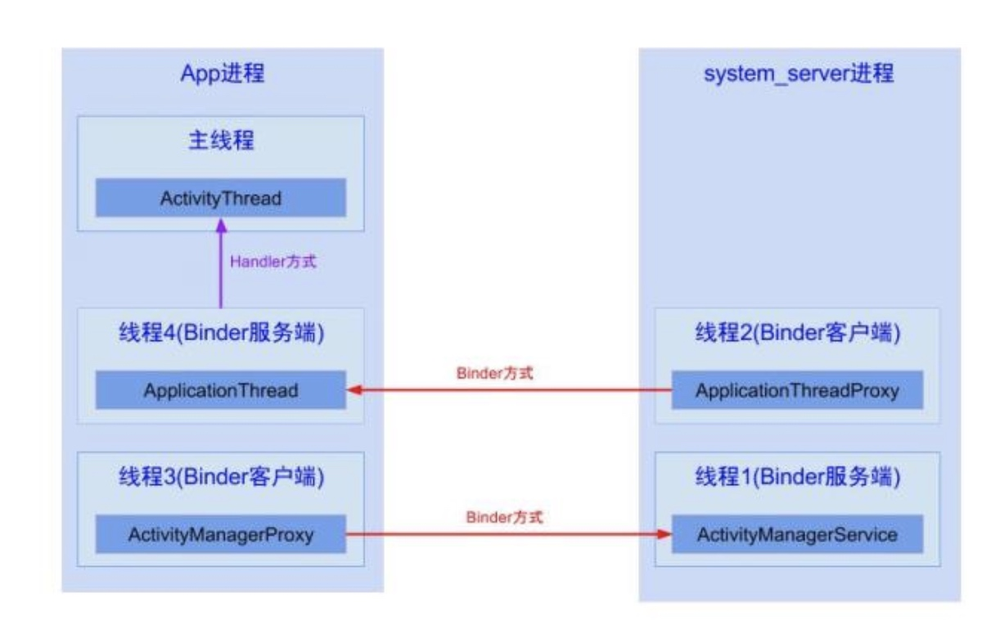
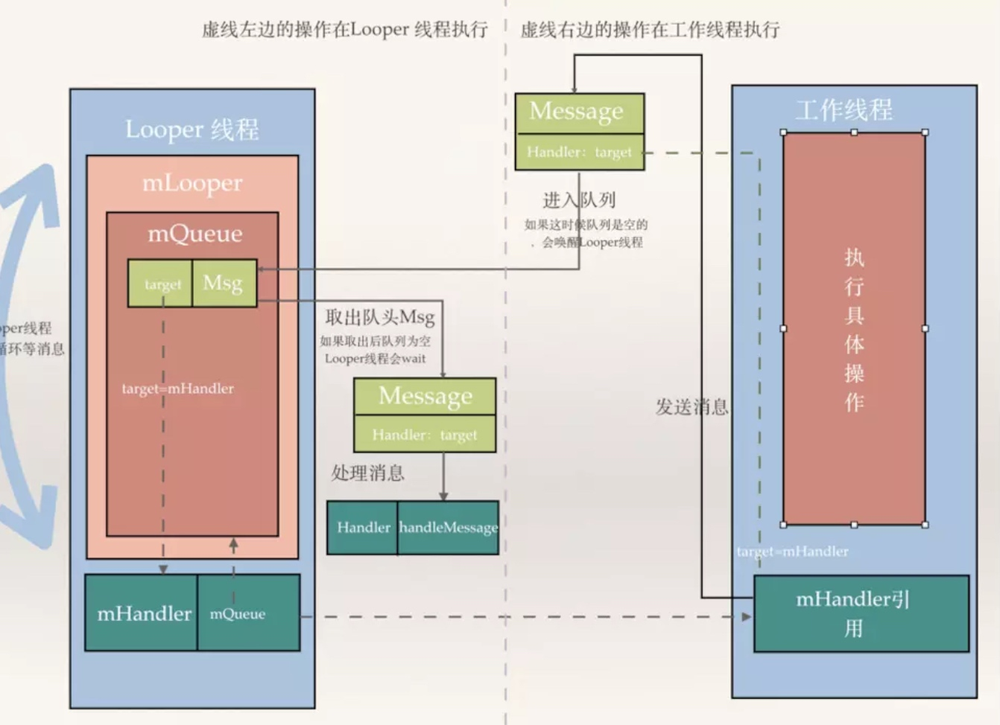

## 概述

Android 的消息机制主要指的是 Handler 的运行机制，Handler 的运行需要底层的 MessageQueue 和 Looper 的支撑，而传输的对象是 Message。

# 关系图




## 名词解析

**Message**：消息，其中包含了消息ID、消息处理对象以及处理的数据等，由MessageQueue统一列队，最后还是有Handler处理。
**Handler**：处理者，负责Message的发送及处理，使用Handler时，需实现handleMessage(Message msg)方法来对特定的Message进行处理，比如更新UI，更新数据库。
**MessageQueue**：消息队列，用来存放Handler发送过来的消息，并按照FIFO规则执行。当然，存放Message并非实际意义的保存，而是将Message以链表的方式串联起来，等待Looer的抽取。
**Looper**：消息泵/轮询器，Looper用于封装了android线程中的消息循环，默认情况下一个线程是不存在消息循环（message loop）的，需要调用Looper.prepare()来给线程创建一个消息循环队列，每个线程只允许一次，调用Looper.loop()来使消息循环起作用，在ActivityThread中会执行 Looper.prepare()和Looper.loop()方法。使用Looper.prepare()和Looper.loop()创建了消息队列就可以让消息处理在该线程中完成。一直地从MessageQueue中抽取Message执行，如果匹配不到处于阻塞状态。因此，一个MessageQueue需要一个Looper。
**ThreadLocal**:它并非线程，而是在线程中存储数据用的。
**Thread**：线程，负责调度整个消息循环，即消息循环的执行场所。

## Message

Message 是一个继承 Parcelable 的持久化类，通过内部构建一个链表来维护一个被回收的 Message 对象的对象池，当用户调用 obtain() 的时候，会优先从池中取。如果没有会重现创建一个

```
 public static Message obtain() {
        synchronized (sPoolSync) {
            if (sPool != null) {
                Message m = sPool;
                sPool = m.next;
                m.next = null;
                m.flags = 0; // clear in-use flag
                sPoolSize--;
                return m;
            }
        }
        return new Message();
    }

```
通过这个方法，我们可以知道在在获取 Message 对象的时候并不是每次都创建一个，而是获取 Message 的链表头，存储形式是单链表，且此处加入了同步锁保证数据不被污染。
链表中的数据添加是在 Message 要被回收的时候，当要被回收时，会把使用过后的 Message 添加到链表中


```
 public void recycle() {
        if (isInUse()) {
            if (gCheckRecycle) {
                throw new IllegalStateException("This message cannot be recycled because it "
                        + "is still in use.");
            }
            return;
        }
        recycleUnchecked();
    }

    /**
     * Recycles a Message that may be in-use.
     * Used internally by the MessageQueue and Looper when disposing of queued Messages.
     */
    void recycleUnchecked() {
        // Mark the message as in use while it remains in the recycled object pool.
        // Clear out all other details.
        flags = FLAG_IN_USE;
        what = 0;
        arg1 = 0;
        arg2 = 0;
        obj = null;
        replyTo = null;
        sendingUid = -1;
        when = 0;
        target = null;
        callback = null;
        data = null;

        synchronized (sPoolSync) {
            if (sPoolSize < MAX_POOL_SIZE) {
                next = sPool;
                sPool = this;
                sPoolSize++;
            }
        }
    }
```
这个对象池的大小默认为 **50** 个，如果小于50个，则把数据插入到链表的尾部

## MessageQueue
消息队列，内部本质是一个单链表的数据结构。插入使用的enqueueMessage和next方法的实现。从源码中我们可以得到，无论插入还是删除均是在无线循环的，一直在监听此单链表的变化.

    插入：enqueueMessage(Message msg,long when)
    刁调用入口是在 handler.sendMessageAtTime 中。
    读取：next()
    调用入口是在 looper 的死循环中，核心方法为nativePollOnce方法，此方法调用底层它查看当前消息是否有消息，如果有消息则获取，如果没有就等待。

## Looper
轮询器， 扮演着消息轮训的作用.不停的查看 MessageQueue 中是否有消息.常见的 Looper.prepare 方法做了如下事情

```
    private static void prepare(boolean quitAllowed) {
        if (sThreadLocal.get() != null) {
            throw new RuntimeException("Only one Looper may be created per thread");
        }
        sThreadLocal.set(new Looper(quitAllowed));
    }
```

new 了一个 looper， 并且被本地缓存 sThreadLocal 持有。

```
  private Looper(boolean quitAllowed) {
        mQueue = new MessageQueue(quitAllowed);
        mThread = Thread.currentThread();
    }
```
创建Looper 的时候会创建一个此 Looper 的对应的 MessageQueue.
Looper 最关键的是 loop 方法，只有调用了此方法后，消息循环系统才会真正开始工作。

```
 public static void loop() {
        final Looper me = myLooper();
        if (me == null) {
            throw new RuntimeException("No Looper; Looper.prepare() wasn't called on this thread.");
        }
        final MessageQueue queue = me.mQueue;

        // Make sure the identity of this thread is that of the local process,
        // and keep track of what that identity token actually is.
        Binder.clearCallingIdentity();
        final long ident = Binder.clearCallingIdentity();

        for (;;) {
            Message msg = queue.next(); // might block
            if (msg == null) {
                // No message indicates that the message queue is quitting.
                return;
            } 
          
            try {
                msg.target.dispatchMessage(msg);
         
            } finally {
                if (traceTag != 0) {
                    Trace.traceEnd(traceTag);
                }
            }
            // Make sure that during the course of dispatching the
            // identity of the thread wasn't corrupted.
            final long newIdent = Binder.clearCallingIdentity();
            if (ident != newIdent) {
                Log.wtf(TAG, "Thread identity changed from 0x"
                        + Long.toHexString(ident) + " to 0x"
                        + Long.toHexString(newIdent) + " while dispatching to "
                        + msg.target.getClass().getName() + " "
                        + msg.callback + " what=" + msg.what);
            }

            msg.recycleUnchecked();
        }
    }
```
looper 方法里面本质是一个死循环，跳出循环的终止条件是 MessageQueue 中next 方法返回为 null。loop 方法会调用 messageQueue 的 next 方法，而 next 方法是一个阻塞的方法，当没有消息时，next 一直阻塞，导致 looper 也阻塞在这边。如果 next 有返回值，则会执行 msg.target.dispatchMessage(msg)，这里的 msg.target 指的就是当前的 handler，这样消息就成功的交给了 Handler 的 dispatchMessage 来处理。
## ThreadLocal
帮助 handler 获得当前线程的 Looper，不同线程访问同一个 ThreadLocal 的 get 方法，ThreadLocal 内部会从各自的线程中取出一个数组，然后再从数组中根据当前ThreadLocal 的索引去查找出对应的 valu e值。也就说不同的 Looper 是相互独立的，主要看下 set / get 方法。
先看 set，value即要存储的数据。ThreadLocalMap 是ThreadLocal中的一个内部类，主要用来存储threadLocal中的数据，下面会详细说明。通过上面这段代码，我们可以知道，set方法首先会获取当前线程的ThreadLocalMap。如果map不为空，则直接更新数据；否则，创建ThreadLocalMap，同时将value值放入该map中，ThreadLocalMap是ThreadLocal中的一个静态内部类

```
//Sets the current thread's copy of this thread-local variable
     * to the specified value.  
   public void set(T value) {
        Thread t = Thread.currentThread();
        ThreadLocalMap map = getMap(t);
        if (map != null)
            map.set(this, value);
        else
            createMap(t, value);
    }

```

通过源码我们可以知道，get方法也是先要获取ThreadLocalMap ，若ThreadLocalMap 不为空，则获取其内部的Entry
```
// Returns the value in the current thread's copy of this thread-local variable. 
public T get() {
        Thread t = Thread.currentThread();
        ThreadLocalMap map = getMap(t);
        if (map != null) {
            ThreadLocalMap.Entry e = map.getEntry(this);
            if (e != null) {
                @SuppressWarnings("unchecked")
                T result = (T)e.value;
                return result;
            }
        }
        return setInitialValue();
    }
```
由上面对ThreadLocal的set和get方法的分析，我们可以看出，我们操作的始终是当前线程的ThreadLocalMap，存放的数据在Entry中，table中又存放了大量的Entry，对Entry进行管理，而table数组又在当前线程的ThreadLocalMap，所以我们在不同线程中访问同一个ThreadLocal的set和get方法时，它们对ThreadLocal的读/写操作都仅仅是在各自线程的内部而已。这就解释了为什么ThreadLocal可以在多个线程中互不干扰地存储和修改数据了。

# 经典问题
**【问题】Android中为什么主线程不会因为Looper.loop()里的死循环卡死？**
 对于线程既然是一段可执行的代码，当可执行代码执行完成后，线程生命周期便该终止了，线程退出。而对于主线程，我们是绝不希望会被运行一段时间，自己就退出，那么如何保证能一直存活呢？简单做法就是**可执行代码是能一直执行下去的，死循环便能保证不会被退出**.
 
**【问题】主线程的死循环一直运行是不是特别消耗CPU资源?** 
 涉及到Linux pipe/epoll机制，简单说就是在主线程的MessageQueue没有消息时，便阻塞在loop的queue.next()中的nativePollOnce()方法里.此时主线程会释放CPU资源进入休眠状态，直到下个消息到达或者有事务发生，通过往pipe管道写端写入数据来唤醒主线程工作。这里采用的epoll机制，是一种IO多路复用机制，可以同时监控多个描述符，当某个描述符就绪(读或写就绪)，则立刻通知相应程序进行读或写操作，本质同步I/O，即读写是阻塞的。 所以说，主线程大多数时候都是处于休眠状态，并不会消耗大量CPU资源。

**【问题】结合消息机制，说说Activity onResume的方法的内部流程**
ActivityThread的内部类H继承于Handler，通过handler消息机制，简单说Handler机制用于同一个进程的线程间通信。Activity的生命周期都是依靠主线程的Looper.loop，当收到不同Message时则采用相应措施：在H.handleMessage(msg)方法中，根据接收到不同的msg，执行相应的生命周期。
线程1的AMS中调用线程2的ATP；（由于同一个进程的线程间资源共享，可以相互直接调用，但需要注意多线程并发问题）线程2通过binder传输到App进程的线程4；线程4通过handler消息机制，将暂停Activity的消息发送给主线程；主线程在looper.loop()中循环遍历消息，当收到暂停Activity的消息时，便将消息分发给ActivityThread.H.handleMessage()方法，再经过方法的调用，最后便会调用到Activity.onPause()，当onPause()处理完后，继续循环loop下去。


