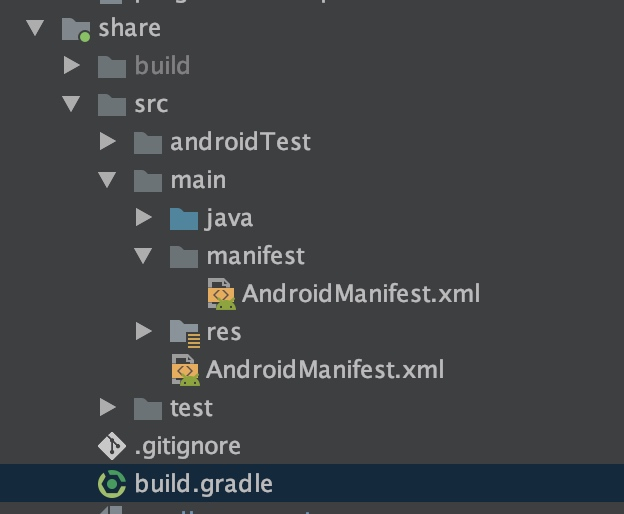
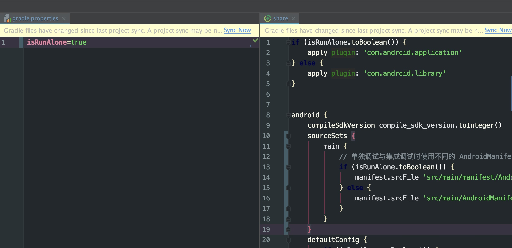
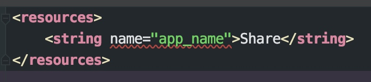
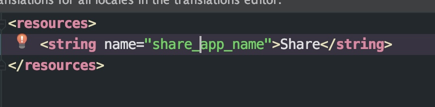

# 概述
架构是顶层设计；框架是面向编程或配置的半成品；组件是从技术维度上的复用；模块是从业务维度上职责的划分；系统是相互协同可运行的实体。

# 模块化与组件化的区别
随着项目的越来越大，会有一个从普通的无架构到模块化，模块化到组件化的过程.
* 模块
  模块指的是独立的业务模块，一般有首页模块，登录模块，账单模块等
* 组件> 
组件指的是单一的功能组件，如支付组件，忘记密码组等，每个组件都可以以一个单独的  module 开发，并且可以单独抽出来作为 SDK 对外发布使用。
由此可见，模块与组件之间最明显的区别是：模块相对于组件来说，粒度更大，一个模块中可能包含多个组件。在划分过程中，模块是业务导向，组件化是功能导向。
# 组件化需要解决的问题
1. 每个组件都是一个完整的甄嬛体，所以组件开发过程中药满足单独运行及调试要求
2. 数据传递与组件间方法的相互调用
3. 组件间界面跳转，不同组件之间不仅会有数据的传递，也会有相互的页面跳转。
4. 如何进行集成调试
5. 组件解耦的目标以及如何实现代码隔离

# 组件单独调试
除了通过依赖的插件来配置不同的工程，我们还要根据 isRunAlone 的值来修改其他配置，一个 APP 是只有一个 ApplicationId 的，所以在单独调试和集成调试时组件的 ApplicationId 应该是不同的；一般来说一个 APP 也应该只有一个启动页， 在组件单独调试时也是需要有一个启动页，在集成调试时如果不处理启动页的问题，主工程和组件的 AndroidManifes 文件合并后就会出现两个启动页，这个问题也是需要解决的。
ApplicationId 和 AndroidManifest 文件都是可以在 build.gradle 文件中进行配置的，所以我们同样通过动态配置组件工程类型时定义的 isRunAlone 这个变量的值来动态修改 ApplicationId 和 AndroidManifest。首先我们要新建一个 AndroidManifest.xml 文件，加上原有的 AndroidManifest 文件，在两个文件中就可以分别配置单独调试和集成调试时的不同的配置




其中 AndroidManifest 文件中国的内容如下

```
// main/manifest/AndroidManifest.xml 单独调试
<?xml version="1.0" encoding="utf-8"?>
<manifest xmlns:android="http://schemas.android.com/apk/res/android"
    package="com.loong.share">

    <application
        android:allowBackup="true"
        android:icon="@mipmap/ic_launcher"
        android:label="@string/app_name"
        android:roundIcon="@mipmap/ic_launcher_round"
        android:supportsRtl="true"
        android:theme="@style/AppTheme">
        <activity android:name=".ShareActivity">
            <intent-filter>
                <action android:name="android.intent.action.MAIN" />

                <category android:name="android.intent.category.LAUNCHER" />
            </intent-filter>
        </activity>
    </application>

</manifest>

// main/AndroidManifest.xml 集成调试
<?xml version="1.0" encoding="utf-8"?>
<manifest xmlns:android="http://schemas.android.com/apk/res/android"
    package="com.loong.share">

    <application android:theme="@style/AppTheme">
        <activity android:name=".ShareActivity"/>
    </application>

</manifest>

```
然后在 build.gradle 中通过判断 isRunAlone 的值，来配置不同的 ApplicationId 和 AndroidManifest.xml 文件的路径

```
android {
    defaultConfig {
        if (isRunAlone.toBoolean()) {
            // 单独调试时添加 applicationId ，集成调试时移除
            applicationId "com.loong.login"
        }
        ...
    }
    
    sourceSets {
        main {
            // 单独调试与集成调试时使用不同的 AndroidManifest.xml 文件
            if (isRunAlone.toBoolean()) {
                manifest.srcFile 'src/main/manifest/AndroidManifest.xml'
            } else {
                manifest.srcFile 'src/main/AndroidManifest.xml'
            }
        }
    }
}

```
此时，我们只需要修改各个 module 的 isRunAlone 参数即可完成组件的单独调试。

# 组件间数据传递与方法的相互调用

# 组件解耦的目标以及代码隔离
* 代码隔离
通过 Gradle 提供的方式来解决，Gradle 3.0 提供了新的依赖方式 runtimeOnly ，通过 runtimeOnly 方式依赖时，依赖项仅在运行时对模块及其消费者可用，编译期间依赖项的代码对其消费者时完全隔离的。
* 资源隔离
在 module/build.gradle 文件中增加以下配置

```
android {
    resourcePrefix "login_"
    // 其他配置 ...
}

```
此参数代表资源文件的前缀。加上这句话后，res 中 xml 的定义就需要加上“share_”的前缀了，如下图
未加之前

加了之后

